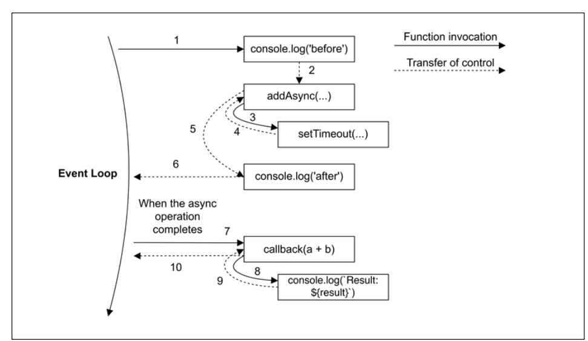

# 3장 - 콜백과 이벤트

비동기 프로그래밍에서는 I/O 작업을 백그라운드로 실행 가능.<br>
Node.js에서 비동기 작업의 완료를 통지받는 기본 매커니즘은 **콜백**


## 콜백 패턴

콜백은 리액터 패턴의 핸들러를 구현한 것.<br>
콜백은 동기적으로 사용되는 return 명령의 사용을 대신함.<br>
자바스크립트에서 함수는 일급객체이므로, 변수에 할당하거나 인자로 전달되거나 반환값, 자료구조에 저장될 수 있기 때문에 콜백에 이상적인 언어임.<br>
또 콜백을 구현하는 다른 이상적인 구조는 **클로저**임.
클로저를 사용하면 콜백 함수가 실행될 때 필요한 컨텍스트를 유지할 수 있음.

### 연속 전달 방식 (CPS)

함수형 프로그래밍에서 콜백으로 작업 완료를 계속 전달하는 방식을 **연속 전달 방식 (Continuation-Passing Style)** 이라고 함.<br>
값을 절대로 Return 하지 않고, 함수는 리턴 값으로 호출가능 한 콜백을 받음.<br>

#### 동기식 CPS
```js
function add(a, b) {
    return a + b
}
```
위는 일반적인 함수 호출 방식이며, **직접 스타일 (Direct Style)** 이라고 함.<br>
이걸 CPS 방식으로 바꾼다면,
```js
function addCps(a, b, callback) {
    callback(a + b)
}

console.log("Before addCps")
addCps(2, 3, result => console.log("Result:", result))
console.log("After addCps")
```
이러면 이것은 **동기식 CPS** 방식임.<br>

#### 비동기식 CPS

```js
function addCpsAsync(a, b, callback) {
    setTimeout(() => callback(a + b), 1000)
}

console.log("Before addCpsAsync")
addCpsAsync(2, 3, result => console.log("Result:", result))
console.log("After addCpsAsync")
```
이렇게 바꾼다면 **비동기식 CPS** 방식임.<br>
setTimeout()은 비동기 작업을 트리거하므로, 콜백을 기다려주지 않음. 따라서 제어권이 즉시 addCpsAsync(caller)에게 반환됨.<br>
그리고 addCpsAsync는 다시 제어권을 caller에게 반환함.<br>
**Node.js에서 비동기 요청이 전달되면 즉시 제어권을 이벤트 루프에게 반환하여 새로운 이벤트를 처리할 수 있도록 함.**<br>


setTimeout() 비동기 작업이 끝나면, 이벤트 루프에서 다시 callback이 실행됨.<br>
실행은 이벤트 루프에서 시작되므로 새로운 스택을 가짐.<br>
클로저 덕분에 콜백이 다른 시점과 위치에서 실행되더라도 원래의 컨텍스트를 유지할 수 있음.<br>

#### Non-CPS 콜백

```js
const result = [1, 2, 3].map(x => x * 2);
```

위에서 map 함수는 콜백을 사용하지만 CPS 방식이 아님.<br>
동기적으로 실행되고 콜백은 연산 결과를 받지 않음.<br>
Non-CPS 콜백과 CPS 콜백에는 문법적으로 차이가 없으므로, API 문서에 콜백의 목적이 정확히 명시되어야 함.

### 동기? 비동기?

동기와 비동기에 따라 명령어의 실행 순서는 근본적으로 달라짐.<br>
따라서 동기와 비동기를 혼용하는 것은 피해야 함.<br>

#### 예측할 수 없는 함수
```js
const cache = new Map()

function inconsistentRead(filename, cb) {
    if (cache.has(filename)) {
        cb(cache.get(filename))
    } else {
        fs.readFile(filename, (err, data) => {
            cache.set(filename, data)
            cb(data)
        })
    }
}
```
위 함수는 캐싱 유무에 따라 동기 또는 비동기로 동작함.<br>

#### Zalgo를 풀어놓다

```js
function createFileReader(filename) {
    const listeners = []
    inconsistentRead(filename, value => {
        listeners.forEach(listener => listener(value))
    })
    
    return {
        onDataReady: listener => listeners.push(listener)
    }
}
```
이 함수는 파일 읽기 작업에 대해 여러 리스너를 등록할 수 있는 객체를 반환함.<br>
읽기 작업이 완료되면 등록된 모든 리스너를 호출함.<br>
이제 createFileReader()를 아래처럼 사용함.
```js
const reader1 = createFileReader('data.txt')
reader1.onDataReady(data => {
    console.log(`Reader1 received data: ${data}`)
    
    const reader2 = createFileReader('data.txt')
    reader2.onDataReady(data => {
        console.log(`Reader2 received data: ${data}`)
    })
})
```

reader1이 생성될 때 inconsistentRead()는 비동기로 동작함.<br>
따라서 reader1가 생성된 후, onDataReady() 안의 콜백은 reader1에 정상적으로 등록됨. (파일 읽기 작업은 시간이 꽤 걸리므로)<br>
그러나 reader2가 생성될 때는 inconsistentRead()가 캐시된 값을 즉시 반환하므로 동기적으로 동작함.<br>
따라서 reader2가 생성된 후 onDataReady()안의 콜백은 이미 forEach()가 실행된 이후 등록되기 때문에 호출되지 않음.<br>
이 문제는 실제 애플리케이션에서는 식별하고 재현하기 어려움.<br>
이처럼 예측 불가능한 함수들을 Node.js 프로젝트 리더인 Issac Z Schlueter는 "Zalgo를 풀어놓다"라고 표현함.<br>

#### 동기 API 사용

Zalgo를 막는 방법 중 하나는 동기 API만 사용하는 것임.<br>
```js
import { readFileSync } from 'fs'
const cache = new Map()
function consistentReadSync(filename) {
    if (cache.has(filename)) {
        return cache.get(filename)
    }
    const data = readFileSync(filename, 'utf8')
    cache.set(filename, data)
    return data
}
```
동기 함수는 CPS 스타일 대신 직접 스타일을 사용함.<br>

동기 API를 사용할 떄 주의할 점은 다음과 같음.
- 특정 기능을 위한 동기식 API가 없을 수도 있음.
- 동기식 API는 블로킹이므로, 긴 작업을 수행하면 이벤트 루프가 멈추어 전체 애플리케이션 성능에 악영향을 미칠 수 있음.

파일 수가 제한적이라면 괜찮으나, 큰 파일을 읽거나 많은 파일을 읽어야 할 땐 성능이 심각하게 저하될 수 있음.<br>
Node.js에서 동기 I/O 사용은 권장되지 않으나, bootstrap 단계에서 사용 등은 괜찮음.<br>

#### 지연 실행(deferred execution)으로 비동시성을 보장

Zalgo 문제를 해결하는 다른 방법은 함수를 완전한 비동기로 만드는 것임.<br>
여기서 핵심은 동기식 콜백 호출을 즉시 실행시키는 대신 미래에 실행되도록 지연시키는 것임.<br>
Node.js에서는 process.nextTick()을 사용하여, 콜백을 현재 실행이 끝난 뒤 실행되도록 연기할 수 있음.<br>
콜백은 이벤트 큐의 맨 앞에 추가되어 대기중인 모든 I/O 이벤트보다 먼저 실행됨.
```js
import { readFile } from 'fs'
const cache = new Map()
function consistentReadAsync(filename, callback) {
    if (cache.has(filename)) {
        process.nextTick(() => callback(cache.get(filename)))
    } else {
        readFile(filename, (err, data) => {
            cache.set(filename, data)
            callback(data)
        })
    }
}
```
코드 실행을 지연하는 다른 방법은 `setImmediate()`임.<br>
process.nextTick()과 유사하나, process.nextTick()으로 지연된 콜백은 마이크로태스크(microtask)라고 불림.<br>
마이크로태스크는 현재 작업이 끝난 뒤 즉시 실행되며, I/O 이벤트보다 먼저 실행됨.<br>
반면에 setImmediate()는 모든 I/O 이벤트가 처리 된 후 다음 이벤트 루프 사이클에 실행됨.<br>
process.nextTick()은 이미 스케줄링 된 I/O 이벤트보다 먼저 실행되므로, 과도하게 사용(재귀 호출 같은)하면 I/O 이벤트가 실행되지 못하는 상황이 발생할 수 있음. (I/O starvation)<br>
setImmediate()는 I/O 이벤트가 모두 처리된 후에 실행되므로 이런 문제가 없음.<br>

setTimeout(callback, 0)은 setImmediate()와 유사하게 동작함.<br>
하지만 일반적으로 setImmediate()가 setTimeout(callback, 0)보다 먼저 실행됨.<br>
I/O 콜백 전에 실행되는 타이머 페이즈 (setTimeout, setInterval)이 있고, setImmediate()는 I/O 콜백 다음에 실행됨.<br>
따라서 setImmediate()로 콜백을 넣는 시점이 setTimeout 콜백 내부, I/O 콜백 내부, 혹은 마이크로태스크 내부라면 setImmediate()가 setTimeout(callback, 0)보다 먼저 실행될 수 있음.<br>

### Node.js 콜백 규칙

Node.js에서 CPS API 및 콜백은 다음 규칙을 따름.

#### 콜백은 맨 마지막에
`readFile(filename, [options], callback)`처럼 콜백은 항상 마지막 인자로 전달됨.

#### 오류는 맨 처음에
CPS에서는 오류가 결과처럼 콜백으로 전달됨.<br>
Node.js에서는 CPS 함수에서 발생된 오류는 항상 첫 번째 인자로 전달됨.<br>
```js
readFile('foo.txt', (err, data) => {
    if (err) handleError(err)
    else processData(data)
})
```
에러가 있는지 항상 체크하는 것이 좋으며, 에러는 항상 Error 타입이어야 함.<br>

#### 오류 전파
동기식 직접 스타일에서는 throw문으로 오류가 호출 스택을 따라 전파됨.<br>
하지만 비동기 CPS 스타일에서는 오류를 콜백으로 전달해야 함.<br>
```js
import { readFile } from 'fs'
function readJSON(filename, callback) {
    readFile(filename, 'utf8', (err, data) => {
        let parsed
        if (err) return callback(err) // 에러를 전파하고 현재 함수에서 빠져나감
        try {
            parsed = JSON.parse(data)
        } catch (err) {
            return callback(err)
        }
        callback(err, parsed)
    })
}
```
에러가 나면 에러를 리턴하는 것이 아니라 콜백으로 전달해야 함.<br>
그리고 try...catch 문에서도 콜백을 실행하지 않는데, 이는 콜백 함수의 에러를 catch문에서 잡지 않기 위함임.<br>

#### 캐치되지 않는 예외

비동기 콜백 내부에서 발생한 예외는 이벤트 루프까지 전파됨.<br>
따라서 Node.js에서는 바로 프로세스가 종료될 수 있음.<br>
```js
function readJSONThrows(filename, callback) {
    readFile(filename, 'utf8', (err, data) => {
        if (err) return callback(err)
        const parsed = JSON.parse(data)
        callback(null, parsed)
    })
}

try {
    readJSONThrows('invalid.json', (err) => console.error(err))
} catch (e) {
    console.error("This will not catch JSON parse errors:", e)
}
```
이렇게 하더라도 호출 스택이 다르기 때문에, try...catch문에서 예외를 잡지 못함.<br>
Node.js에서는 프로세스를 종료하기 이전에 uncaughtException 이벤트를 발생시킴.<br> 
```js
process.on('uncaughtException', (err) => {
    console.error('There was an uncaught error', err)
    process.exit(1) // 프로세스를 종료함
})
```
uncaughtException이 발생하면, 서비스가 불안정한 상태로 동작할 수 있으므로 프로세르를 종료하는 것이 권장됨.<br>
이 것을 Node.js에서는 fast-fail 이라고 함.<br>

## 관찰자 패턴 (Observer Pattern)
Node.js에서 사용되고 비동기 프로그래밍에서 널리 사용되는 중요한 패턴은 **관찰자 패턴 (Observer Pattern)** 임.<br>
관찰자 패턴은 상태 변화가 일어나면, 관찰자(listener) 들에게 알릴 수 있는 객체(주체, called subject)를 정의하는 것임.<br>
콜백 패턴과의 차이점은 주체가 여러 관찰자에게 알릴 수 있다는 것임.<br>

### EventEmitter 클래스
Node.js에서 제공하는 EventEmitter 클래스를 이용하면 관찰자 패턴을 쉽게 구현할 수 있음.<br>
```js
import { EventEmitter } from 'events'
const eventEmiiter = new EventEmitter()
```
EventEmitter의 주요 메소드는 다음과 같음.<br>
- `on(event, listener)`: 주어진 이벤트 (string | symbol)에 대한 리스너를 등록함.
- `once(event, listener)`: 주어진 이벤트에 대한 리스너를 등록 함. (한 번 이후 삭제됨)
- `emit(event, [arg1], [...])`: 이벤트를 발생시키고 리스너에게 전달할 인자를 같이 전달함.
- `removeListener(event, listener)`: 이벤트에 대한 특정 리스너를 제거함.

위의 메소드는 chaining이 가능하므로 각 메소드는 EventEmitter를 반환함.

### EventEmitter 생성 및 사용

```js
import { EventEmitter } from 'events'

function findRegex(files, regex) {
    const emitter = new EventEmitter()
    for (const file of files) {
        readFile(file, 'utf8', (err, data) => {
            if (err) {
                return emitter.emit('error', err)
            }
            emitter.emit('fileread', file)
            const matched = data.match(regex)
            if (matched) {
                match.forEach((element) => {
                    emitter.emit('found', file, element)
                })
            }
        })
    }
}
```