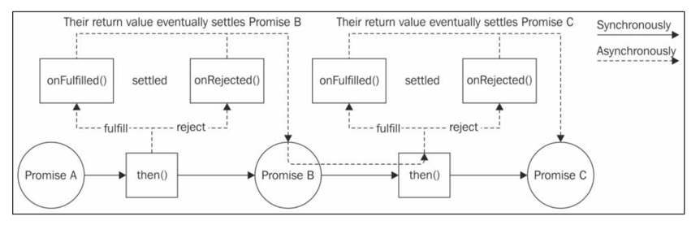
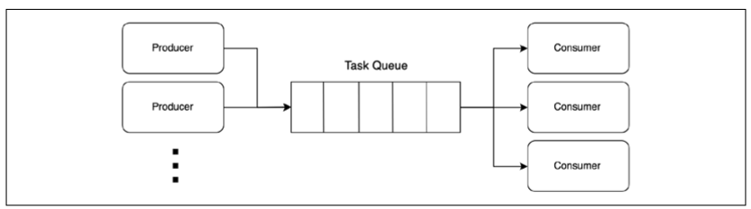

# Promise 그리고 Async/Await과 함께 하는 비동기 제어 흐름 패턴

콜백은 다음과 같은 문제가 있음.
- 콜백 지옥
- 순차적인 실행 흐름은 복잡하고 오류가 발생하기 쉬움
- 오류를 다음 실행으로 넘기는 것을 잊으면 안전하지 않음
- Zalgo가 발생하기 쉬움

Promise는 상태를 전달하는 객체로 비동기 작업의 최종 결과를 나타냄.<br>
또한 순차적인 실행 흐름을 나타내기 위해 async/await 구조가 도입됨.

## Promise
ECMAScript2015(ES6)에서 도입됨.

### Promise란 무엇인가?
비동기 작업의 최종적인 결과를 담고 있는 객체.<br>
- Pending: 비동기 작업이 아직 완료되지 않았을 때
- Fulfilled (이행됨): 비동기 작업이 성공적으로 끝났을 때
- Rejected: 비동기 작업이 에러와 함께 실패했을 때
- Settled: 비동기 작업이 성공적으로 끝났거나 실패했을 때 (Fulfilled 또는 Rejected 상태)

Fulfillment 값이나 Rejection(에러) 값을 받기 위해 `then()` 함수를 사용할 수 있음.
```js
promise.then(onFulfilled, onRejected);
```
프로미스는 CPS의 코드를 더 우아하게 만들어 줌.
```js
asyncOperation(arg, (err, result) => {
    if (err) {
        // 에러 처리
    }
    // 결과 처리
})
asyncOperation(arg)
    .then(result => {
        // 결과 처리
    }, err => {
        // 에러 처리
    });
```
then() 메소드는 또 다른 프로미스를 동기적으로 반환할 수 있음.<br>
onFulfilled나 onRejected의 값이 x 일때, then() 메소드는 다음과 같이 동작함.
- x가 값인 경우: x를 가지고 fulfill 함.
- x가 프로미스인 경우: x의 fulfillment 값을 가지고 fulfill 함.
- x가 프로미스인 경우: x의 rejection 값을 가지고 reject 함.

이렇게 프로미스를 체이닝해서 사용할 수도 있음.<br>
그리고 onFulfilled나 onRejected를 명시하지 않는다면, 값이나 에러는 다음 then()으로 전달됨.<br>
```js
asyncOperationPromise(arg)
.then(result1 => {
    return asyncOperationPromise(arg2); // 다른 프로미스를 반환
})
.then(result2 => {
    return "done" // 값을 반환
})
.then(undefined, err => {
    // 체인내의 에러를 여기서 catch 함.
})
```
<br>
프로미스 A를 호출하면, 그 결과를 동기적으로 프로미스 B를 받음. (C도 동일)<br>
프로미스를 사용하면 동기적으로 resolve할 수 있으며, 그 사이에 비동기적으로 onFulfilled()나 onRejected()가 실행된다는 것임.<br>
프로미스 객체가 then이 호출되는 순간 결정되어 있어도, 비동기적으로 onFulfilled()나 onRejected()가 호출됨.<br>
이건 Zalgo 문제를 방지할 수 있음.<br>
또한 throw를 통해 에외가 발생되면, 자동으로 체이닝된 모든 프로미스에 전달됨.<br>
이건 콜백을 통해 에러 전파하는 것보다 훨씬 쉽고 안전함.

### Promise/A+와 thenable
역사적으로 많은 Promise 구현체가 있었고, 서로 호환되지 않는 경우가 많았음.<br>
그래서 Promise/A+라는 사양이 만들어졌고, then() 함수를 통해 서로 호환되도록 함.<br>
네이티브 JS의 Promise API를 포함한 많은 프로미스 구현들은 then()함수가 있는 객체를 thenable이라는 Promise와 유사한 객체로 간주함.<br>

### Promise API
`new Promise((resolve, rejected) => {})` 형태로 프로미스를 생성함.<br>
- resolve(obj): 호출될 때 제공된 fulfillment 값으로 프로미스를 fulfill(이행)함.
  - obj가 값이면 obj가 전달되고, Promise나 thenable이면 obj의 fulfillment 값이 전달됨.
- reject(err): err와 함께 프로미스를 reject(거부)함. err는 Error 인스턴스

Promise의 static method는 다음과 같음.<br>
`Promise.resolve(obj)`: 새로운 프로미스를 생성. obj가 프로미스이면 그대로 반환하고, thenable이면 해당 라이브러리의 프로미스를 반환, 값이면 그 값으로 프로미스가 이행됨.<br>
`Promise.reject(err)`: 새로운 프로미스를 생성. err와 함께 거부된 프로미스를 반환함.<br>
`Promise.all(iterable)`: 반복 가능한 객체내의 모든 프로미스가 이행되면, 이행된 결과값의 배열을 이행값으로하여 이행하는 새로운 프로미스를 생성.<br>
만약 하나라도 거부되면, 그 거부 이유를 가지고 거부된 프로미스를 생성.<br>
`Promise.allSettled(iterable)`: Promise.all와 유사하나, 모든 프로미스가 이행되거나 거부될 때까지 기다림.<br>
이행된 프로미스는 status, value, reason 속성을 가진 객체 배열을 반환.<br>
`Promise.race(iterable)`: 반복 가능한 객체에서 처음으로 결정돤(settled) 프로미스를 반환.

Promise의 instance method는 다음과 같음.<br>
- `promise.then(onFulfilled, onRejected)`: 새로운 프로미스를 반환함. Promise/A+ 표준과 호환.
- `promise.catch(onRejected)`: promise.then(undefined, onRejected)의 편리한 버전.<br>
- `promise.finally(onFinally)`: 프로미스가 결정(settle)될 때 호출되는 콜백을 등록함.<br>
onFinally는 입력으로 인자를 받지 않으며, 반환된 프로미스는 현재 프로미스의 이행값 또는 거부 사유로 결정됨.

### 프로미스 생성하기
프로미스를 처음부터 만드는 것은 저수준의 작업으로, 다른 비동기 형식(콜백 기반)을 사용하는 API를 변환해야할 때 필요한 작업임.<br> 
대부분 다른 라이브러리에서 생성된 프로미스를 사용할 것이며, then() 메소드를 통해 사용할 것임.<br>
하지만 수동으로 프로미스를 생성해야할 때도 있을 것.<br>

이 함수는 지정된 밀리초 후에 현재 시간을 이행값으로 하는 프로미스를 반환하는 함수임.<br>
then() 핸들러 안의 console.log()는 delay() 함수가 호출된 후 약 1초 후에 실행될 것임.
```js
function delay(millisecond) {
    return new Promise((resolve, reject) => {
        setTimeout(() => {
            resolve(new Date())
        }, millisecond)
    })
}

console.log(`Delaying... ${new Date().getSeconds()}`);
delay(1000)
  .then(newDate => {
        console.log(`Done. ${newDate.getSeconds()}`);
  })
```

### 프로미스화 (Promisification)
콜백 기반함수를 프로미스를 반환하는 함수로 변환하는 것임.<br>
Node.js 방식의 콜백 기반 함수는 다음 규악을 따름.<br>
- 콜백은 함수의 마지막 인자
- 에러가 있다면, 콜백의 첫 번째 인자로 전달
- 모든 반환값은 콜백 함수의 에러 다음에 전달됨.

```js
function promisify(callbackBasedApi) {
    return function promiseified(...args) {
        return new Promise((resolve, reject) => {
            const newArgs = [
                ...args,
                function (err, result) {
                  if (err) {
                      return reject(err);
                  }
                  resolve(result);
                }
            ]
            callbackBasedApi(...newArgs)
        })
    }
}
import { randomBytes } from 'crypto';

const randomBytesPromise = promisify(randomBytes)
randomBytesPromise(32)
    .then(bytes => {
        console.log(`Random bytes: ${bytes.toString()}`);
    });

```
promisified() 함수는 프로미스 생성자를 이용해 새로운 프로미스를 생성함.<br>
콜백은 맨 마지막 인자에 오므로, 기존 인자들 뒤에 콜백 함수를 인자로 추가함.<br>
그렇게 새로 만든 인자를 promisify 함수의 인자인 함수의 파라미터로 전달함.<br>
그리고 콜백에서 에러가 있다면 reject()를 호출하고, 그렇지 않으면 resolve()를 호출함.<br>

위 promisify 함수는 둘 이상의 결과를 반환하는 콜백을 처리하는 기능 등이 누락되었음.<br>
실제 환경에서는 Node.js의 util.promisify() 함수를 사용하는 것이 더 나음.

### 순차 실행과 반복
4장에서 만든 웹 스파이더(크롤링) 애플리케이션을 프로미스로 변환할 수 있음.
```js
import { promises as fsPromises } from 'fs'; // fs 모듈의 프로미스 기반 API 사용
import { dirname } from 'path';
import superagent from 'superagent';
import mkdirp from 'mkdirp';
import { urlToFilename, getPageLinks } from './utils.js';
import { promisify } from 'util';

const mkdirpPromise = promisify(mkdirp); // mkdirp를 프로미스화

function download(url, filename) {
    console.log(`Downloading ${url}`)
    let content
    return superagent.get(url)
        .then((res => {
            content = res.text
            return mkdirpPromise(dirname(filename))
        }))
        .then(() => fsPromises.writeFile(filename, content))
        .then(() => {
            console.log(`Downloaded and saved: ${url}`);
            return content;
        });
}

function spiderLinks(currentUrl, content, nesting) {
    let promise = Promise.resolve()     // empty promise
    if (nesting === 0) {
        return promise;
    }
    const links = getPageLinks(currentUrl, content)
    for (const link of links) {
        promise = promise.then(() => spider(link, nesting - 1))
    }
    return promise
}

// spiderLinks 함수를 reduce()를 이용해서 작성할 수도 있음.
function spiderLinksReduce(currentUrl, content, nesting) {
    if (nesting === 0) {
        return Promise.resolve();
    }
    
    const links = getPageLinks(currentUrl, content)
    return links.reduce((prev, task) => {
        return prev.then(() => {
            return task()
        })
    }, Promise.resolve())
}

export function spider(url, nesting) {
    const filename = urlToFilename(url)
    return fsPromises.readFile(filename, 'utf8')
        .catch((err) => {       // 파일이 있다면 catch 절은 건너뜀.
            if (err.code !== 'ENOENT') { 
                throw err
            }
            return download(url, filename) // 파일이 없으면 catch문에서 다운로드
        }) 
        .then(content => spiderLinks(url, content, nesting))
}

const url = "https://www.naver.com"
const nesting = 3;
spider(url, nesting)
  .then(() => console.log(`Download complete`))
  .catch(err => console.error(err))
```

### 병렬 실행
Promise.all을 이용해서 여러 프로미스를 병렬로 실행 가능함.<br>
```js
function spiderLinks(currentUrl, content, nesting) {
    if (nesting === 0) {
        return Promise.resolve();
    }
    const links = getPageLinks(currentUrl, content);
    const promises = links.map(linke => spider(link, nesting - 1));
    return Promise.all(promises)
}
```
이 방법은 이전의 순차 반복 루프와 비교하면 새로운 작업이 시작되기 전에 이전 작업이 끝나기를 기다리지 않는 다는 것임.<br>
모든 spider() 작업은 이벤트 루프의 동일한 주기에서 실행됨.<br>

### 제한된 병렬 실행
웹 스파이더 애플리케이션이 동시성을 제한하도록 변경할 수 있음.<br>

#### 프로미스를 사용한 TaskQueue 구현
```js
next() {
    while (this.running < this.concurrency && this.queue.length) {
        const task = this.queue.shift()
        task().finally(() => { // task() 함수는 Promise를 반환한다고 가정
            this.running--
            this.next()
        })
        this.running++
    }
}

runTask(task) {
    return new Promise((resolve, reject) => {     // 1
        this.queue.push(() => {                   // 2  
            return task().then(resolve, reject)   // 4  
        })
        process.nextTick(this.next.bind(this))    // 3
    })
}
```
1에서 새로운 프로미스를 생성함.<br>
2에서는 큐에 작업을(래핑 함수) 추가함. 이 함수는 다음 next() 실행시 동시성 여유가 있을때 실행 됨.<br>
3에서는 next()를 호출해 새로운 작업을 시작시킴. next()에서 next()를 호출시키기 때문에 다음 이벤트 루프 틱으로 넘김.<br>
4에서는 대기열에 넣은 래핑 함수가 실행되면, task()를 실행하고 그 settle 값을 프로미스로 전달함.

#### 웹 스파이더 수정
```js
function spiderLinks(currentUrl, content, nesting, queue) {
    if (nesting === 0) {
        return Promise.resolve()
    }
    const links = getPageLinks(currentUrl, content)
    const promises = links.map(link => spiderTask(link, nesting - 1, queue))
    return Promise.all(promises)
}

const spidering = new Set()
function spiderTask(url, nesting, queue) {
    if (spidering.has(url)) {
        return Promise.resolve()
    }
    spidering.add(url)
    const filename = urlToFilename(url)
    return queue.runTask(() => {
        return fsPromises.readFile(filename, 'utf8')
            .catch((err) => {
                if (err.code !== 'ENOENT') {
                    throw err
                }
                return download(url, filename)
            })
            .then(content => spiderLinks(url, content, nesting, queue))
    })
}

export function spider(url, nesting, concurrency) {
    const queue = new TaskQueue(concurrency)
    return spiderTask(url, nesting, queue)
}
```

## Async/Await
순차적인 비동기 코드를 작성할 때 프로미스는 한계를 가짐.<br>
then()을 이용해서 체이닝을 계속해야 하며, 함수를 계속해서 만들어야 함.<br>
따라서 그에 대한 해답으로 async/await이 ECMAScript에 도임됨.<br>

async/await을 사용하면 전통적인 동기적 코드와 유사한 방식으로 사용이 가능함.<br>
오늘날 async/await은 Node.js와 JavaScript에서 비동기 코드를 처리할 때 가장 권장되는 방법임.<br>
그러나 async/await은 모든 비동기 제어 흐름을 처리할 수 없으며, Promise API에 의존적임.

### async 함수와 await 표현
async 함수는 주어진 프로미스가 해결될 때 까지 함수의 실행을 "일시 정지"하기 위한 표현식인 await을 사용할 수 있는 특별한 유형의 함수.<br>
```js
async function playingWithDelays() {
    console.log(`Delaying... ${new Date()}`);
    const dateAfterOneSecond = await delay(1000);
    console.log(dateAfterOneSecond)
    const dateAfterThreeSecond = await delay(3000);
    console.log(dateAfterThreeSecond)
    return "done"
}
```
async/await은 마법처럼 동작하며, 코드가 비동기 작업을 하는 것 처럼 보이지 않음.<br>
하지만 실제로는 비동기적으로 실행되며, 각 await 표현에서 함수의 실행이 보류되고 있음.<br>
실행이 보류될 때 상태가 저장되며 제어가 이벤트 루프로 반환됨.<br>
Promise가 아닌 곳에 await을 사용하면 Promise.resolve()에 값을 전달하는 것과 동일함.<br>

```js
playingWithDelays()
  .then(result => {
      console.log(`After 4 seconds: ${result}`)
  })
```
async 함수는 항상 프로미스를 반환함.<br>
이것은 async 함수의 반환값이 Promise.resolve()에 전달된 것과 동일함.<br>

### Async/await에서의 에러 처리
async/await을 사용하면 비동기 코드의 가독성을 올려줄 뿐만 아니라, 에러 처리에도 도움이 됨.<br>
try...catch 블록을 사용하여 동기 코드와 유사한 방식으로 에러를 처리할 수 있음.<br>

#### 통일된 try...catch 사용
```js
function delayError(milliseconds) {
    return new Promise((resolve, reject) => {
        setTimeout(() => {
            reject(new Error(`Error after ${milliseconds}ms`))
        }, milliseconds)
    })
}
async function playingWithErrors(throwSyncError) {
    try {
        if (throwSyncError) {
            throw new Error(`This is a synchronous error`)
        }
        await delayError(1000);
    } catch (e) {
        console.error(`We have an error: ${e.message}`);
    } finally {
        console.log('Done')
    }
}
```
위 playingWithErrors 함수는 동기 에러와 비동기 에러를 모두 처리할 수 있음.<br>
프로미스와 async/await을 통해 4장의 에러 처리보다 가독성이 훨씬 좋아짐.<br>

#### "return" 대 "return await" 함정
흔한 안티패턴 중 하나는 async/await을 사용할 때 try...catch 블록에서 await 표현식을 사용하지 않는 것임.<br>
```js
async function errorNotCaught() {
    try {
        return delayError(1000)
    } catch (e) {
        console.error(`Error caught by the async function: ${e.message}`);
    }
}
errorNotCaught()
  .catch(err => console.error(`Error caught by the caller: ${err.message}`));
```
delayError()의 반환값인 프로미스는 로컬에서 await 하지 않음.<br>
따라서 caller에게 반환되고, 로컬의 캐치 블록에서는 잡히지 않음.<br>
`Error caught by the caller: Error after 1000ms`가 출력됨.<br>
만약 로컬에서 에러를 잡고 싶다면, 다음과 같이 await을 사용해야 함.<br>
```js
async function errorCaught() {
    try {
        return await delayError(1000)
    } catch (e) {
        console.error(`Error caught by the async function: ${e.message}`);
    }
}
errorCaught();
  .catch(err => console.error(`Error caught by the caller: ${err.message}`));
```
이제 `Error caught by the async function: Error after 1000ms`가 출력됨.<br>

#### 순차 실행과 반복
async/await을 사용하여 순차적인 비동기 코드를 아주 효과적으로 사용할 수 있음.<br>
```js
// 웹 스파이더 버전2
async function download(url, filename) {
    console.log(`Downloading ${url}`);
    const { text: content } = await superagent.get(url);
    await mkdirpPromise(dirname(filename));
    await fsPromises.writeFile(filename, content);
    console.log(`Downloaded and saved: ${url}`);
    return content;
}
```
또한 배열을 반복할 떄도 유용함.<br>
```js
async function spiderLinks(currentUrl, content, nesting) {
    if (nesting === 0) {
        return;
    }
    const links = getPageLinks(currentUrl, content);
    for (const link of links) {
        await spider(link, nesting - 1);
    }
}

export async function spider(url, nesting) {
    const filename = urlToFilename(url);
    let content
    try {
        content = await fsPromises.readFile(filename, 'utf8');
    } catch (err) {
        if (err.code !== 'ENOENT') {
            throw err;
        }   
        content = await download(url, filename);
    }
    await spiderLinks(url, content, nesting);
}
```
위와 같이 웹 스파이더 애플리케이션을 async/await을 이용해 간단하게 작성할 수 있음.<br>

#### 안티패턴 - 순차 실행을 위한 Array.forEach와 async/await의 사용
개발자들이 흔히 Array.forEach() 또는 Array.map()을 이용해 순차적 비동기 반복을 async/await을 구현하려고 함.<br>
이는 안티패턴이며 생각한 것처럼 동작하지 않음.<br>
```js
links.forEach(async function iteration(link) {
    await spider(link, nesting - 1)
})
```
위 코드는 각 link 요소마다 iteration 함수를 비동기적으로 호출함.<br>
await 표현식을 이용해 spider() 함수를 실행해 프로미스 객체를 전달받지만, forEach()는 이 프로미스를 기다리지 않음.<br>
따라서 모든 spider() 호출이 즉시 시작됨.<br>

#### 병렬 실행
async/await을 사용하면서 병렬 실행을 하는 방법은 크게 두 가지가 있음.<br>
하나는 순수한 await 표현식을 사용하는 것이고, 다른 하나는 Promise.all()을 사용하는 것임.<br>
Promise.all()을 사용하는 방식이 더 권장됨.<br>
```ts
async function spiderLinks(currentUrl, content, nesting) {
    if (nesting === 0) {
        return;
    }
    const links = getPageLinks(currentUrl, content);
    const promises = links.map(link => spider(link, nesting - 1));
    for (const promise of promises) {
        await promise;
    }
}
```
위 코드는 모든 spider() 호출을 map에서 루프를 돌면서 즉시 시작함.<br>
그리고 각 프로미스가 이행될 때까지 await 표현식을 통해 기다림.<br>
하지만 promises 중 하나라도 실패(거부)되더라도, 나머지 프로미스의 결과를 모두 기다려야 함.<br>
Promise.all을 사용하면 배열 중 하나라도 거부되면 즉시 거부된 프로미스를 반환하므로 더 효율적임.<br>
```js
async function spiderLinks(currentUrl, content, nesting) {
    if (nesting === 0) {
        return;
    }
    const links = getPageLinks(currentUrl, content);
    const promises = links.map(link => spider(link, nesting - 1));
    return Promise.all(promises);
}
```

#### 제한된 병렬 실행
앞에서 만든 TaskQueue를 async/await으로 변경할 수 있음.<br>
또한 웹 스파이더 버전4도 async/await으로 변경할 수 있으며, Producer/Consumer 패턴도 적용할 수 있음.<br>
<br>
- 프로듀서는 미리 정의되지 않으며, 작업 큐에 작업을 추가함.
- 컨슈머는 미리 정의되었으며, 작업 큐에서 작업을 가져와 실행함.

컨슈머의 수가 동시성 수준을 결정함.<br>
작업 큐가 비어있다면, 컨슈머는 새 작업이 추가될 때까지 대기(sleep)함.<br>
Node.js는 단일 스레드로 동작하므로 sleep은 이벤트 루프로 제어권을 반환하는 것을 의미하며, 재개하는 것은 콜백을 호출하는 것과 동일함.<br>

```js
export class TaskQueuePC {
    constructor(concurrency) {
        this.taskQueue = [];
        this.consumerQueue = [];

        // 컨슈머 생성
        for (let i = 0; i < concurrency; i++) {
            this.consumer();
        }
    }
    
    async consumer() {
        while (true) {          // 1
            try {
                const task = await this.getNextTask()       // 2
                await task()                                // 3
            } catch (e) {
                console.error(e)                            // 4
            }
        }
    }
    
    async getNextTask() {
        return new Promise((resolve) => {
            if (this.taskQueue.length != 0) {
                return resolve(this.taskQueue.shift()) // 5
            }
            this.consumerQueue.push(resolve)            // 6
        })
    }
    
    // producer가 호출하는 메소드
    runTask(task) {
        return new Promise((resolve, reject) => {
            const taskWrapper = () => {
                const taskPromise = task();
                taskPromise.then(resolve, reject)
                return taskPromise
            }
            
            if (this.consumerQueue.length != 0) {
                const consumer = this.consumerQueue.shift()
                consumer(taskWrapper)
            } else {
                this.taskQueue.push(taskWrapper)
            }
        })
    }
}
```
taskQueue는 작업이 추가되는 큐이며, consumerQueue는 대기 중인 컨슈머의 큐임.<br>
컨슈머는 무한 루프안에서 동작하며 (1), getNextTask()를 호출해 다음 작업을 가져옴 (2)<br>
작업이 있다면 작업을 실행하며 (3) 만약 큐가 비어있다면 sleep 하게 됨.<br>
오류가 발생하더라도 무한 루프는 지속되어야 하므로 단순히 에러 로그만 출력함.(4)<br>

무한 루프를 돌기 때문에 cpu 점유율이 높아보일 수 있으나, 다른 언어와 달리 Node.js에서는 이벤트 루프에 제어권을 반환하기 때문에 실제로는 그렇지 않음.<br>

getNextTask() 함수안에서는 만약 작업 큐에 작업이 있다면 해당 작업을 프로미스로 반환함 (5)<br>
큐가 비어있다면 consumerQueue에 resolve 함수를 추가하여 프로미스의 resolve를 나중에 호출할 수 있도록 함 (6)<br>

runTask() 함수는 프로듀서가 호출하는 함수임.<br>
만약 큐가 비어있다면 작업 큐에 인자로 받은 task를 감싼 taskWrapper를 추가함.<br>
만약 큐가 비어있지 않으면 consumerQueue에서 대기 중인 컨슈머를 꺼내와 taskWrapper를 전달함.<br>

## 무한 재귀 프로미스 해결(resolution) 체인의 문제
무한 프로미스 체인에 의해 메모리 누수가 발생할 수 있음.<br>
Promise/A+ 사양을 잘 지키더라도 메모리 누수는 발생할 수 있음.<br>
```js
function leakingLoop() {
    return delay(1)
        .then(() => {
            console.log(`Tick ${Date.now()}`)
            return leakingLoop()
        })
}
```
위 함수는 재귀적으로 자신을 호출하며, resolve를 하려할 때 다음 leakingLoop()의 결과를 기다리고 있음.<br>
따라서 절대로 결정(settle)되지 않는 무한 프로미스 체인이 만들어짐.<br>
이 문제를 해결하려면 resolve의 체인을 끊으면 됨. 위에서는 단순히 return을 하지 않는 것으로 해결할 수 있음.
```js
function nonLeakingLoop() {
    return delay(1)
        .then(() => {
            console.log(`Tick ${Date.now()}`)
            nonLeakingLoop()
        })
}
```
그러나 위 함수는 중첩된 nonLeakingLoop()의 에러가 제대로 전파되지 않는다는 문제가 있음.<br>

```js
function nonleakingLoopWithErrors() {
    return new Promise((resolve, reject) => {
        (function internalLoop() {
            delay(1)
                .then(() => {
                    console.log(`Tick ${Date.now()}`)
                    internalLoop()
                })
                .catch(err => {
                    reject(err)
                })
        })
    })()
}
```
위와 같이 변경하면 중첩된 internalLoop()에서 발생한 에러가 외부 프로미스에 전달됨.<br>
또 다른 방법은 async/await을 사용하는 것임.
```js
async function nonLeakingLoopWithAsync() {
    while (true) {
        await delay(1)
        console.log(`Tick ${Date.now()}`)
        leakingLoopWithAsync()
    }
}
```
위 방법은 원래 동작과 동일하며, 에러도 제대로 전파됨.<br>
그러나 다음처럼 다시 return을 넣게되면 절대로 settle되지 않는다는 문제가 다시 발생할 수 있으니 주의해야 함.
```js
async function leakingLoopWithAsync() {
    while (true) {
        await delay(1)
        console.log(`Tick ${Date.now()}`)
        return leakingLoopWithAsync()
    }
}
```