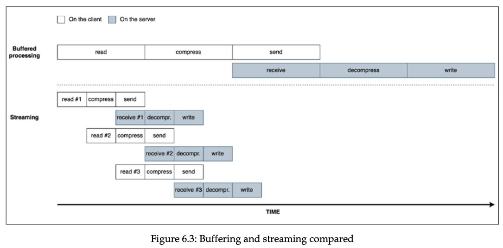
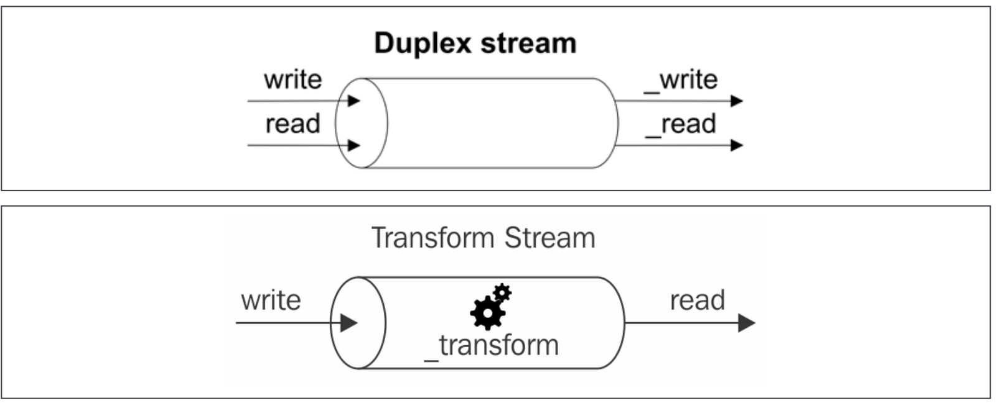

# 스트림 코딩

Node.js에서 스트림은 가장 중요한 컴포넌트이자 패턴.<br>
성능, 효율성, 우아함 등 여러 장점이 있음.

## 스트림의 중요성 발견
Node.js 같은 이벤트 기반 플랫폼에서 I/O를 처리하는 가장 효율적인 방법은 실시간으로 입출력을 하는 것임.

### 버퍼링 대 스트리밍
지금까지 본 비동기 API는 작업이 완료될 때 까지 버퍼에다가 데이터를 저장한 뒤, 전송하는 방식이였음.<br>
하지만 스트림을 이용하면 버퍼에 데이터가 모이기 전에 바로 소비자에게 전달 가능함.<br>
버퍼 대신 스트림을 사용하면 메모리 사용량과 시간에서 더 효율적일 수 있음.<br>
그리고 Node.js 스트림에는 또 중요한 **조립성(composability)** 이란 것이 있음.

### 공간 효율성
대용량 파일 읽기 시나리오에서 파일 전체를 메모리에 올리면 용량이 부족해질 수 있음.<br>

Node.js의 버퍼 크기는 다음 코드로 확인 가능함.
```js
import buffer from 'buffer'
console.log(buffer.constants.MAX_LENGTH)
```
node 20.19.2에서는 약 4기가

#### 버퍼링 API를 사용한 Gzipping
GZIP을 이용해 파일을 압축하는 간단한 예제
```js
import { promises as fs } from 'fs'
import { gzip } from 'zlib'
import { promisify } from 'util'
const gzipPromise = promisify(gzip)

const filename = process.argv[2]
async function main() {
    const data = await fs.readFile(filename)
    const gzippedData = await gzipPromise(data)
    await fs.writeFile(`${filename}.gz`, gzippedData)
    console.log('File successfully compressed')
}
main()
```
위 코드는 8GB 정도의 파일을 테스트해보면 파일 사이즈가 최대 버퍼 크기보다 크다는 오류가 발생할 가능성이 큼.

#### 스트림을 사용한 Gzipping
스트리밍 API를 이용하면 다음과 같음
```js
import { cretaeReadStream, createWriteStream } from 'fs'
import { createGzip } from 'zlib'

createReadStream(filename)
    .pipe(createGzip())
    .pipe(createWriteStream(`${filename}.gz`))
    .on("finish", () => console.log("File successfully compressed"));
```

### 시간 효율성
파일을 압축하고 서버에 업로드 한 뒤, 파일을 압축 해제하고 다운로드 하는 시나리오를 생각해보자.<br>
```js
import { createServer } from "node:http";
import { createWriteStream } from "node:fs";
import { createGunzip } from "node:zlib";
import { basename, join } from "node:path";

const server = createServer((req, res) => {
    const filename = basename(req.headers['x-filename'])
    const destFilename = join('received_files', filename)
    req
        .pipe(createGunzip())
        .pipe(createWriteStream(destFilename))
        .on('finish', () => {
            res.writeHead(201, { 'Content-Type': 'text/plain'})
            res.end('OK\n')
        })
})
server.listen(8080);
```
위의 req 객체는 네트워크에서 청크단위로 요청 데이터를 수신하기 위해 서버가 사용하는 스트림 객체임.<br>
Node.js 스트림 덕분에 모든 데이터 청크는 수신되는 즉시 압축 해제되어 디스크에 저장됨.
클라이언트 측 코드는 다음과 같음.
```js
import { reqeust } from 'node:http'
import { cretaeReadStream } from 'fs'
import { createGzip } from 'zlib'
import { basename } from 'path'

const filename = process.argv[2]
const serverHost = process.argv[3]
const req = request({
    hostname: serverHost,
    port: 3000,
    path: '/',
    method: 'PUT',
    headers: {
        'Content-Type': 'application/octet-stream',
        'Content-Encoding': 'gzip',
        'X-Filename': basename(filename)
    },
}, (res) => {
    console.log(`Server response: ${res.statusCode}`)
})

cretaeReadStream(filename)
    .pipe(createGzip())
    .pipe(req)
    .on('finish', () => {
        console.log('File successfully sent');
    });
```
파일에서 데이터를 스트림을 사용해 읽은 뒤 즉시 GZIP 압축을 수행하고, 압축된 데이터를 네트워크를 통해 서버로 전송함.<br>

스트림을 이용하면 전체 파일을 읽을 때까지 기다리지 않고 첫번째 데이터 청크를 수신하자마자 압축 해제를 시작할 수 있음.<br>
그리고 다른 데이터 청크를 사용할 수 있을 때 이전 데이터 청크의 작업이 완료되는 것을 기다릴 필요가 없음.<br>
실행하는 각 작업이 비동기적이기 때문에 Node.js에 의해 병렬화 될 수 있기 때문임.<br>
유일한 제약은 청크가 각 단계에 도착하는 순서를 유지해야 하는 점이나 Node.js 스트림은 이를 자동으로 처리함.<br>

### 조립성 (Composability)
지금까지 pipe() 메소드를 이용해서 여러 스트림을 연결하는 것을 보았음.<br>
이는 스트림이 균일한 인터페이스를 가지고 있고 API 측면에서 서로를 이해할 수 있기 때문임.<br>

이 속성의 힘을 보여주는 또 다른 예제로, 이전에 만든 예제에 암호화를 추가하면 다음과 같음.<br>

(클라이언트)
```js
import { createCipheriv, randomBytes } from 'node:crypto'

const secret = Buffer.from(process.argv[4], 'hex')  // 커맨드라인에서 16진수 문자열로 비밀키를 전달받음
const iv = randomBytes(16) // 초기화 벡터 생성

const req = request({
    hostname: serverHost,
    port: 3000,
    path: '/',
    method: 'PUT',
    headers: {
        'Content-Type': 'application/octet-stream',
        'Content-Encoding': 'gzip',
        'X-Filename': basename(filename),
        'X-Initialization-Vector': iv.toString('hex'),      // 초기화 벡터를 16진수 문자열로 변환하여 헤더에 포함
    },
}, (res) => {
    console.log(`Server response: ${res.statusCode}`)
})

cretaeReadStream(filename)
    .pipe(createGzip())
    .pipe(cretaeCipheriv('aes192', secret, iv)) // Gzip 이후 암호화 스트림 추가
    .pipe(req)
    .on('finish', () => {
        console.log('File successfully sent');
    });
```

(서버)
```js
import { createDecipheriv, randomBytes } from 'node:crypto'

const secret = randomBytes(24)
console.log(`Secret key (hex): ${secret.toString('hex')}`)      // 클라이언트에게 전달할 비밀키 출력

const server = createServer((req, res) => {
    const filename = basename(req.headers['x-filename'])
    const iv = Buffer.from(req.headers['X-Initialization-Vector'], 'hex') // 헤더에서 초기화 벡터를 16진수 문자열로 읽어옴
    const destFilename = join('received_files', filename)
    req
        .pipe(createDecipheriv('aes192', secret, iv)) // 암호 해제 스트림 추가
        .pipe(createGunzip())
        .pipe(createWriteStream(destFilename))
        .on('finish', () => {
            res.writeHead(201, { 'Content-Type': 'text/plain'})
            res.end('OK\n')
        })
})
```
약 몇줄의 코드를 추가한 것 만으로도 암호화 계층을 애플리케이션에 추가할 수 있음.<br>
이 방식의 주요 장점은 재사용성이지만 스트림을 사용하면 더 깔끔하고 모듈화된 코드를 작성할 수 있음.<br>

## 스트림 시작하기
스트림은 Node.js의 모든 곳에 존재함.<br>
fs 모듈의 createReadStream(), createWriteStream() 메소드부터 HTTP 요청과 응답 객체까지 모두 스트림임.<br>
zlib 모듈에도 데이터 압축 및 압축 해제를 위한 스트림이 있고, 'crypto' 모듈에도 암호화 및 복호화를 위한 스트림이 있음.<br>

### 스트림 해부
Node.js의 모든 스트림은 스트림 코어 모듈에서 사용할 수 있는 네 가지 추상 클래스의 구현임.<br>
- Readable
- Writable
- Duplex
- Transform

각 스트림 클래스는 EventEmitter의 인스턴스 이기도 함.<br>
실제로 스트림은 읽기가 끝났을 때 end, 쓰기를 완료할 때 finish, 에러가 났을 때 error 등 여러 이벤트를 방출함.<br>
스트림이 유연한 이유 중 하나는 바이너리 데이터 뿐만 아니라 거의 모든 JavaScript의 값을 처리할 수 있기 때문임.<br>

- Binary mode: 버퍼 또는 문자열과 같은 청크 형태로 데이터를 스트리밍함.
- Object mode: 데이터를 개별 객체의 시퀀스로 스트리밍함.(거의 모든 JavaScript 값 가능)

### Readable 스트림
Readable 스트림은 데이터 소스를 나타냄.

#### 스트림에서 읽기
Readable 스트림에서 데이터를 수신하는 방법은 non-flowing(paused) 모드와 flowing 모드 두 가지가 있음.<br>

#### non-flowing (paused) 모드
Readable 스트림에서 읽기를 위한 기본 패턴.<br>
스트림에 읽을 수 있는 데이터가 있다는 것을 나타내는 readable 이벤트에 대해 리스너를 등록함.<br>
그런 다음 루프에서 내부 버퍼가 비워질 때까지 데이터를 계속해서 읽음.<br>
이는 내부 버퍼에서 동기적으로 데이터를 읽어 데이터 청크를 나타내는 Buffer 객체를 반환하는 read() 함수를 사용하여 수행할 수 있음.

`readable.read([size])` 를 사용하면 스트림에서 데이터를 강제로 읽을 수 있음.<br>
```js
process.stdin.on(
    'readable', () => {
        let chunk;
        console.log('New data available:');
        while ((chunk = process.stdin.read()) !== null) {
            console.log(`Received ${chunk.length} bytes of data. ${chunk.toString()}`);
        }
    }
)
    .on('end', () => {
        console.log('End of stream');
    })
```

#### Flowing 모드
스트림에서 읽는 또 다른 방법은 데이터 이벤트에 리스너를 연결하는 것임.<br>
여기서 데이터는 read()를 사용해서 가져오지 않고 대신 도착하자마자 다음 리스너로 전달됨.<br>
```js
process.stdin
    .on('data', (chunk) => {
        console.log('New data available:');
        console.log(`Received ${chunk.length} bytes of data. ${chunk.toString()}`);
    })
    .on('end', () => {
        console.log('End of stream');
    })
```
flowing 모드는 non-flowing 모드보다 스트림에서 데이터를 읽는 시점을 제어할 수 없음.<br>
스트림의 기본 동작모드가 non-flowing 모드이므로 flowing 모드를 활성화하려면 리스너를 데이터 이벤트에 연결하거나,<br>
resume() 함수를 호출해야 함. pause() 함수를 호출하면 다시 non-flowing 모드로 전환됨.<br>

#### 비동기 반복자
Readable 스트림은 비동기 반복자(Iterator)이기도 함.
```js
async function main() {
    for await (const chunk of process.stdin) {
        console.log('New data available:');
        console.log(`Received ${chunk.length} bytes of data. ${chunk.toString()}`);
    }
    console.log('End of stream');
}
main();
```
Readable 스트림 전체를 소비하고 프로미스를 반환해야할 때 위 패턴이 유용함.<br>

```ts
interface ReadableStream extends EventEmitter {
    readable: boolean;
    read(size?: number): string | Buffer;
    setEncoding(encoding: BufferEncoding): this;
    pause(): this;
    resume(): this;
    isPaused(): boolean;
    pipe<T extends WritableStream>(destination: T, options?: { end?: boolean | undefined }): T;
    unpipe(destination?: WritableStream): this;
    unshift(chunk: string | Uint8Array, encoding?: BufferEncoding): void;
    wrap(oldStream: ReadableStream): this;
    [Symbol.asyncIterator](): AsyncIterableIterator<string | Buffer>;
}
```
ReadableStream 인터페이스에 asyncIterator 메소드가 정의되어 있음을 알 수 있음.<br>

#### Readable 스트림 구현
Readable 스트림 구현을 위해서는 스트림 모듈에서 Readable 프로토타입을 상속하여 새로운 클래스를 만들어야 함.<br>
구현된 클래스는 다음과 같은 특징을 가진 _read() 함수의 구현을 제공해야 함.<br>
`readble._read(size)`<br>
Readable 클래스는 내부적으로 _read() 함수를 호출하는데 이 함수는 push() 함수를 사용하여 내부 버퍼에 데이터를 추가함.<br>
`readable.push(chunk)`
```ts
import { Readable, ReadableOptions } from "node:stream";
import Chance from "chance";

const chance = new Chance();
export class RandomStream extends Readable {
    emittedBytes: number = 0;

    constructor(options: ReadableOptions) {
        super(options);
        this.emittedBytes = 0;
    }

    _read(size: number) {
        const chunk = chance.string({ length: size }); // chance를 사용하여 size와 동일한 길이의 임의의 문자열 생성
        this.push(chunk, "utf-8"); // 문자열을 내부 버퍼에 추가. 문자열이기 때문에 인코딩도 추가해야 함.
        this.emittedBytes += chunk.length;
        if (chance.bool({ likelihood: 5 })) {
            // 5% 확률로 스트림 종료 (null을 푸시하기 위함)
            this.push(null);
        }
    }
}

const randomStream = new RandomStream({
    encoding: "utf-8",
    highWaterMark: 1024,
});
randomStream
    .on("data", (chunk) => {
        console.log(`Received ${chunk.length} bytes of data: ${chunk}`);
    })
    .on("end", () => {
        console.log(
            `End of stream. Total emitted bytes: ${randomStream.emittedBytes}`,
        );
    });

```
chance는 임의의 문자열을 생성하는 라이브러리임.<br>
RandomStream의 생성자에서 `super(options: ReadableOptions)`를 호출하여 스트림의 내부 상태를 초기화 가능함.<br>

ReadableOptions 객체에는 다음 속성이 있음.
- buffer를 string으로 변환하는데 사용되는 인코딩 인자 (encoding, 예를 들어 'utf-8')
- object mode를 활성화하는 boolean 플래그 (objectMode, 기본값은 false)
- 내부 버퍼의 최대 크기를 바이트 단위로 지정하는 highWaterMark (기본값은 16KB)
- 그리고 아래에서 설명할 read() 함수

```ts
interface ReadableOptions<T extends Readable = Readable> extends StreamOptions<T> {
    encoding?: BufferEncoding | undefined;
    read?: ((this: T, size: number) => void) | undefined;
}
```

_read() 함수에서 size 인자는 스트림이 내부 버퍼에 추가하기를 원하는 바이트 수임.<br>

#### 단순화된 생성자(simplified construction)
간단한 사용자 정의 스트림의 경우 Readable 스트림의 단순화된 생성자 접근 방식을 사용할 수 있음.<br>
ReadableOptions 인터페이스에 read 함수가 정의되어 있기 때문에, read 함수를 정의한 ReadableOptions 객체를 생성자에 넣으면 됨.<br>
read() 함수는 위에서 설명한 _read() 함수와 동일한 역할을 함.<br>
(Readable.prototype.read 안에서 _read 를 호출함)
```js
import { Readable } from 'node:stream'
import Chance from 'chance'

const chance = new Chance()
let emittedBytes = 0

const randomStream = new Readable({
    read (size) {
        const chunk = chance.string({ length: size })
        this.push(chunk, 'utf-8')
        emittedBytes += chunk.length
        if (chance.bool({ likelihood: 5 })) {
            this.push(null)
        }
    }
})
```
위의 단순화된 생성자를 사용하고 싶지만 여러 인스턴스를 만들어야 할 땐 팩토리 함수에 생성자 코드를 넣으면 됨.<br>

#### 반복가능자(Iterables)에서 Readable 스트림 얻기
Readable.from()을 사용하여 배열 또는 기타 **반복가능자** 객체(제너레이터, **반복자**와 **비동기 반복자**)에서 Readable 스트림을 생성할 수 있음.<br>

```js
import { Readable } from 'node:stream'
const mountains = [
    { name: 'Everest', height: 8848 },
    { name: 'K2', height: 8611 },
    { name: 'Kangchenjunga', height: 8586 },
    { name: 'Lhotse', height: 8516 },
    { name: 'Makalu', height: 8485 }
]

const mountainStream = Readable.from(mountains, { objectMode: true }) // Readable.from은 명시적으로 objectMode가 true인 스트림을 생성함.
mountainStream.on('data', (mountain) => {
    console.log(`${mountain.name} is ${mountain.height} meters tall.`);
});
```
다만 큰 배열을 인스턴스화 하지는 말아야 함.<br>
데이터를 청크 단위로 사용하기 위해 fs.createReadStream()을 사용하거나 사용자 지정 스트림을 만들거나, 제너레이터, 반복자 또는 비동기 반복자와 함께 Readable.from을 사용할 수 있음.<br>
이것에 대한건 9장에서 다시 살펴볼 것.

### Writable 스트림
Writable 스트림은 대상 데이터의 목적지를 나타냄. 파일 시스템의 파일, DB, 소켓, 표준 출력 인터페이스 등임.<br>

#### 스트림에 쓰기
Writable 스트림에 데이터를 넣는 방법은 write() 함수를 사용하는 것임.<br>
`writable.wrtie(chunk, [encoding], [callback])`<br>
인코딩 인자는 optional 이며 청크가 문자열인 경우에 지정할 수 있음. (기본값은 utf8이고 chunk가 버퍼인 경우에는 무시됨)<br>
반면 콜백은 청크가 기본 리소스로 flush 될 때 호출되며 optional 임.<br>

스트림에 더 이상 쓸 데이터가 없다면 end() 함수를 호출해야 함.<br>
`writable.end([chunk], [encoding], [callback])`<br>
end() 함수를 통해 최종적으로 보낼 마지막 청크를 지정할 수 있음.<br>
여기서 콜백은 스트림에 기록된 모든 데이터가 flush 될 때 실행되는 리스너를 finish 이벤트에 등록하는 것과 같음.<br>

```js
import { createServer } from 'http'
import Chance from 'chance'

const chance = new Chance()
createServer((req, res) => {
    res.writeHead(200, { 'Content-Type': 'text/plain' }) // 응답 헤더 작성 (Writable 아님)
    while (chance.bool({ likelihood: 95})) {            // 95% 확률로 무작위 문자열 작성 후 스트림에 쓰기 (writable.write)
        res.write(chance.string())
    }
    res.end('\n\n')                                     // 스트림에 더 이상 쓸 데이터가 없음을 알림 (writable.end)
    res.on('finish', () => { console.log('Response finished.')}) // finish 이벤트에 리스너 등록
}).listen(8080, () => {
    console.log('Entropy server running at http://localhost:8080/')
})
```

#### 배압 (Backpressure)
Writable 스트림에 데이터를 쓸 때 write() 함수는 boolean 값을 반환함.<br>
만약 내부 버퍼가 highWaterMark 한도에 도달했다면 false를 반환함.<br>
버퍼가 비워지면 `drain` 이벤트가 발생하고, 이 땐 다시 버퍼에 쓸 수 있음.<br>
하지만 write() 함수가 false를 반환해도 에러가 나는 건 아니므로 주의하며 backpressure를 처리해야 함.<br>
```js
import { createServer } from 'http'
import Chance from 'chance'

const chance = new Chance()
createServer((req, res) => {
    res.writeHead(200, { 'Content-Type': 'text/plain' })
    function generateMore() {       // 메인 로직은 generateMore 함수에 있음.
        while (chance.bool({ likelihood: 95})) {
            const randomChunk = chance.string({length: (16 * 1024) - 1})
            const shouldContinue = res.write(`${randomChunk}\n`)
            if (!shouldContinue) {
                console.log('Backpressure detected, pausing generation.')
                return res.once('drain', generateMore)      // 만약 더 이상 보낼수 없다면, drain 이벤트가 발생했을 때 다시 generateMore 함수를 호출하도록 설정
            }
        }
        res.end('\n\n')
    }
    generateMore()
    res.on('finish', () => { console.log('Response finished.')})
}).listen(8080, () => {
    console.log('Entropy server running at http://localhost:8080/')
})
```
위 코드는 highWaterMark 한계의 (16KB)에 매우 근접하게 청크를 생성함.<br>
따라서 write() 함수가 false를 반환할 확률이 높아지고 결과적으로 backpressure가 발생할 가능성이 커짐.<br>

#### Writable 스트림 구현
Readable 스트림과 마찬가지로 Writable 클래스를 상속하고 _write 함수의 구현을 하면 Writable 스트림을 구현할 수 있음.<br>
```js
{ path: <path to a file>, content: <string or buffer> }
```
위 객체를 받는 Writable 스트림의 구현은 다음과 같음.

```ts
import { Writable, WritableOptions } from "node:stream";
import { dirname, join } from "node:path";
import { mkdirp } from "mkdirp";
import { writeFile } from "node:fs";

export class ToFileStream extends Writable {
  constructor(options: WritableOptions) {
    super({ ...options, objectMode: true });
  }

  _write(
    chunk: { path: string; content: string },
    encoding: BufferEncoding,
    callback: (error?: Error | null) => void,
  ) {
    mkdirp(dirname(chunk.path))
      .then(() => writeFile(chunk.path, chunk.content, () => {}))
      .then(() => callback())
      .catch(callback);
  }
}

const tfs = new ToFileStream({});
tfs.write({ path: join("files", "file1.txt"), content: "Hello" }, () => {
    console.log("File 1 written");
});
tfs.write({ path: join("files", "file2.txt"), content: "Node.js" });
tfs.write({ path: join("files", "file3.txt"), content: "streams" });
tfs.end(() => console.log("All files written"));
```

먼저 내부 상태를 초기화 하기 위해서 부모 생성자를 호출함. 이 때 WritableOptions 객체를 전달하는데 objectMode를 true로 설정함.<br>
추가로 highWaterMark (기본값:16KB), decodeString (기본값: true, 문자열을 _write 함수에 전달하기 전에 이진 버퍼로 자동 디코딩. object mode 에서는 무시됨)도 설정 가능함.<br>
그리고 _write()에서 작업이 끝나면 콜백을 호출하는 데, 콜백은 write() 함수에서 전달 가능함.<br>

#### 단순화된 생성자 (simplified construction)
Readable 스트림처럼 Writable 스트림도 단순화된 생성자 방식을 사용할 수 있음.<br>
```ts 
interface WritableOptions<T extends Writable = Writable> extends StreamOptions<T> {
    decodeStrings?: boolean | undefined;
    defaultEncoding?: BufferEncoding | undefined;
    write?:
        | ((
        this: T,
        chunk: any,
        encoding: BufferEncoding,
        callback: (error?: Error | null) => void,
    ) => void)
        | undefined;
    writev?:
        | ((
        this: T,
        chunks: {
            chunk: any;
            encoding: BufferEncoding;
        }[],
        callback: (error?: Error | null) => void,
    ) => void)
        | undefined;
    final?: ((this: T, callback: (error?: Error | null) => void) => void) | undefined;
}
```
```ts
const tfs = new Writable({
    objectMode: true,
    write(
        chunk: { path: string; content: string },
        encoding: BufferEncoding,
        callback: (error?: Error | null) => void,
    ) {
        mkdirp(dirname(chunk.path))
            .then(() => writeFile(chunk.path, chunk.content, () => {}))
            .then(() => callback())
            .catch(callback);
    },
});
```

### Duplex 스트림
Duplex(이중) 스트림은 읽기와 쓰기 모두 가능한 스트림임.<br>
Duplex 스트림은 stream.Readable과 stream.Writable을 상속하는 스트림임.<br>

```ts
interface ReadWriteStream extends ReadableStream, WritableStream {}

class Duplex extends Stream implements NodeJS.ReadWriteStream {}
```

Duplex 스트림은 네트워크 소켓 처럼 읽기/쓰기가 모두 가능한 리소스를 나타낼 때 유용함.<br>
Duplex 스트림을 구현하려면 _read()와 _write() 함수를 모두 구현해야 함.<br>
그리고 allowHalfOpen (기본값: true) 옵션을 통해 스트림이 읽기 또는 쓰기 쪽이 종료되었을 때 다른 쪽도 종료할지 여부를 지정할 수 있음.<br>
만약 한쪽만 object mode로 동작해야 한다면 readableObjectMode 또는 writableObjectMode 옵션을 사용할 수 있음.<br>

### Transform 스트림
Transform 스트림은 데이터 변환을 처리하는 Duplex 스트림의 특별한 형태임.<br>
zlib.createGzip(), crypto.createCipheriv() 등이 Transform 스트림의 예시임.<br>
Duplex 스트림은 단순히 read, write 기능을 제공하는 반면, Transform 스트림은 입력 데이터를 읽고 변환한 후 출력 데이터를 씀.<br>
Duplex 스트림에서는 _read()와 _write() 함수를 구현해야 하지만, Transform 스트림에서는 _transform()와 _flush() 함수를 구현해야 함.<br>

```ts
class Transform extends Duplex {}
```

<br>
Transform 스트림은 input -> output이 명확한 스트림임.<br>

```ts
import { Transform, TransformOptions } from "node:stream";

export class ReplaceStream extends Transform {
  searchStr: string;
  replaceStr: string;
  tail: string;

  constructor(
    searchStr: string,
    replaceStr: string,
    options: TransformOptions,
  ) {
    super({ ...options });
    this.searchStr = searchStr;
    this.replaceStr = replaceStr;
    this.tail = "";
  }

  _transform(
    chunk: string,
    encoding: BufferEncoding,
    callback: (error?: Error | null, data?: string) => void,
  ) {
    const pieces: string[] = (this.tail + chunk).split(this.searchStr);
    const lastPiece = pieces[pieces.length - 1];
    const tailLen = this.searchStr.length - 1;
    this.tail = lastPiece.slice(-tailLen);
    pieces[pieces.length - 1] = lastPiece.slice(0, -tailLen);

    this.push(pieces.join(this.replaceStr));
    callback();
  }

  _flush(callback: (error?: Error | null, data?: string) => void) {
    this.push(this.tail);
    callback();
  }
}

const replaceStream = new ReplaceStream("World", "Node.js");
replaceStream.on("data", (chunk) => console.log(chunk.toString()));

replaceStream.write("Hello W");
replaceStream.write("orld!");
replaceStream.end();


```
_transform() 함수에서는 _write() 함수와 유사하지만, 데이터를 쓰는 것이 아니라 변환한 데이터를 내부 버퍼에 푸시함.<br>
_transform() 함수에서는 문자열을 청크 단위로 받아서 searchStr을 replaceStr로 바꾸는 작업을 수행함.<br>
그리고 tail에다가 마지막 청크의 일부를 저장하는데, 이는 searchStr이 청크 경계에 걸쳐 있을 수 있기 때문임.<br>
_flush() 함수에서는 마지막으로 남은 tail 데이터를 내부 버퍼에 푸시함.<br>

#### 단순화된 생성자 (simplified construction)
Transform 스트림도 단순화된 생성자 방식을 사용할 수 있음.<br>
```ts
const searchStr = "World";
const replaceStr = "Node.js";
let tail = "";
const replaceStream2 = new Transform({
    defaultEncoding: "utf-8",
    transform(
        chunk: string,
        encoding: BufferEncoding,
        callback: TransformCallback,
    ) {
        const pieces: string[] = (tail + chunk).split(searchStr);
        const lastPiece = pieces[pieces.length - 1];
        const tailLen = searchStr.length - 1;
        tail = lastPiece.slice(-tailLen);
        pieces[pieces.length - 1] = lastPiece.slice(0, -tailLen);

        this.push(pieces.join(replaceStr));
        callback();
    },
    flush(callback: TransformCallback) {
        this.push(tail);
        callback();
    }
});
```
#### Transform 스트림을 사용한 데이터 필터링 및 집계
Transform 스트림을 이용해 데이터 필터링 및 집계를 수행할 수 있음.<br>
예를 들어 포춘 500대 기업으로부터 이전 연도의 모든 매출을 포함하는 큰 csv 파일이 있다고 가정해보자.<br>
그리고 CSV 에는 상품타입(type), 판매국가(country), 수익(profit)이 있고, 여기서 Italy에서 판매된 총 수익을 알고 싶다고 해보자.<br> 
```csv
type,country,profit
Household,Namibia,597290.92
Baby Food,Iceland,808579.10
Meat,Russia,277305.60
Meat,Italy,413270.00
Household,Italy,728880.54
```

```ts
import parse from "csv-parse";
import { createReadStream } from "node:fs";
import { Transform, TransformCallback, TransformOptions } from "node:stream";

const csvParser = parse({ columns: true });

export class FilterByCountry extends Transform {
  country: string;

  constructor(country: string, options?: TransformOptions) {
    super({ ...options, objectMode: true });
    this.country = country;
  }

  _transform(
    chunk: { country: string; type: string; profit: number },
    encoding: BufferEncoding,
    callback: (error?: Error | null, data?: any) => void,
  ) {
    if (chunk.country === this.country) {
      this.push(chunk);
    }
    callback();
  }
}

export class SumProfit extends Transform {
  totalProfit: number;

  constructor(options?: TransformOptions) {
    super({ ...options, objectMode: true });
    this.totalProfit = 0;
  }

  _transform(
    chunk: { country: string; type: string; profit: number },
    encoding: BufferEncoding,
    callback: TransformCallback,
  ) {
    this.totalProfit += chunk.profit;
    callback();
  }

  _flush(callback: TransformCallback) {
    this.push(this.totalProfit.toString());
    callback();
  }
}

createReadStream("data.csv")
  .pipe(csvParser)
  .pipe(new FilterByCountry("Italy"))
  .pipe(new SumProfit())
  .pipe(process.stdout);

```
각 Transform 스트림은 object mode로 동작하게끔 생성자에서 정의.<br>
그리고 FilterByCountry 스트림에서는 _transform() 함수에서 조건에 맞는 청크만 내부 버퍼에 푸시함.<br>
SumProfit 스트림에서는 _transform() 함수에서 profit 값을 누적하고, _flush() 함수에서 최종 합계를 내부 버퍼에 푸시함.<br>
totalProfit을 계산할 때 마다 내부 버퍼로 푸시하지 않고, 마지막 flush 시점에만 푸시하게 해서 총 계산 값만 출력하게 됨.<br>
_flush()는 스트림이 종료될 때 자동으로 호출됨.<br>

### PassThrough 스트림
PassThrough 스트림은 변환을 적용하지 않고 데이터를 그대로 전달하는 Transform 스트림의 특별한 형태임.<br>
이 스트림은 Observability(관찰 가능성)과 Lazy(지연) 스트림을 구현하는 데 유용함.<br>
```ts
class PassThrough extends Transform {}
```

#### Observability(관찰 가능성)
스트림 파이프라인의 중간에 PassThrough 스트림을 연결해 데이터 흐름을 관찰할 수 있음.<br>
```ts

let bytesWritten = 0;
const monitor = new PassThrough();
monitor.on("data", (chunk) => {
    bytesWritten += chunk.length;
});
monitor.on('finish', () => {
    console.log(`Total bytes written: ${bytesWritten}`);
})

monitor.write('Hello!');
monitor.end();
```
위 예제에서는 data 이벤트 리스너에서 청크 길이를 누적하여 총 바이트 수를 계산함.<br>
PassThrough 스트림의 장점은 다른 스트림 파이프라인에 연결이 쉽다는 것임.<br>
```ts
cretaeReadStream(filename)
    .pipe(createGzip())
    .pipe(cretaeCipheriv('aes192', secret, iv))
    .pipe(req)
    .pipe(monitor)
    .on('finish', () => {
        console.log('File successfully sent');
    });
```
이렇게 다른 스트림을 건드리지 않고 쉽게 모니터링 기능을 추가할 수 있음.<br>

#### 느린 파이프 연결 (Late piping)
만약 스트림을 파라미터로 넘겨야 하는 API가 있고, 스트림이 아직 준비되지 않은 경우가 있을 수 있음.<br>
(예: 파일 업로드 API에 스트림을 넘겨야 하는데, 업로드할 파일이 아직 생성되지 않은 경우)<br>
이럴 때 PassThrough 스트림을 전달하고 나중에 실제 스트림을 PassThrough 스트림에 파이핑할 수 있음.<br>
```ts
import { PassThrough } from "node:stream";
import { createReadStream } from "node:fs";
import { createBrotliCompress } from "node:zlib";

const filepath = process.argv[2];
const filename = basename(filepath);
const contentStream = new PassThrough();

upload(`${filename}.br`, contentStream)
  .then((res) => {
    console.log(`Server response: ${res.data}`);
  })
  .catch((err) => {
    console.error(err);
    process.exit(1);
  });

createReadStream(filepath).pipe(createBrotliCompress()).pipe(contentStream);
```
위 코드에서는 다음 순서대로 실행됨.
1. 커맨드라인 인자로부터 파일 경로를 읽음.
2. PassThrough 스트림을 생성함.
3. upload() 함수에 PassThrough 스트림을 전달함.
4. ReadStream을 생성하고 실제 파일을 읽고, Brotli로 압축한 뒤 PassThrough 스트림에 파이핑함.

위 코드에서는 upload() 함수를 실행하자마자 업로드가 시작되지만 실제 파일 데이터는 전달되지 않는 상태임.<br> 
파일이 읽히고 압축되면서 데이터가 PassThrough 스트림으로 흘러가고, 그 때 upload() 함수는 이 데이터를 서버로 전송함.<br>

위 패턴을 사용해서 upload() 함수를 수정할 수도 있음.<br>
Readable 스트림을 사용하는 대신 Writable 스트림을 반환하도록 변경할 수 있음.<br>
```ts
function createUploadStream(filename) {
    const connector = new PassThrough();
    upload(filename, connetor);
    return connector;
}

const uploadStream = createUploadStream('a-file.txt');
createReadStream('a-file.txt').pipe(uploadStream);
// OR
uploadStream.write('Hello World');
uploadStream.end();
```

### 지연(Lazy) 스트림
스트림 인스턴스를 즉시 생성하지 않고 나중에 생성해야 할 때가 있음.<br>
스트림 생성은 비용이 많이 드는 작업이고, 한 번에 많은 스트림을 생성하면 에러가 발생하거나 성능이 저하될 수 있기 때문임.<br>
lazystream 라이브러리를 사용하면 실제로 데이터가 요청되기 전까지 스트림 인스턴스 생성을 지연시킬 수 있음.<br>
```ts
import lazystream from "lazystream";

const lazyURandom = new lazystream.Readable(() =>
    fs.createReadStream("/dev/urandom"),
);
```
여기서 lazystream은 PassThrough 스트림을 사용해서 구현됨.<br>
_read() 함수가 처음 호출될 때만 팩토리 함수가 실행되어 실제 Readable 스트림이 생성된 뒤, 생성한 Readable 스트림을 PassThrough 스트림에 파이핑함.<br>
이렇게 하면 많은 스트림을 동시에 생성하지 않고도 필요한 시점에 스트림을 생성할 수 있음.<br>

### 파이프를 사용하여 스트림 연결하기
Unix에서 파이프를 통해 프로그램의 출력을 다음 프로그램의 입력으로 넘길 수 있음.<br>
```commandline
echo Hello World! | sed s/World/Node.js/g
```
Node.js 스트림에서도 유사하게 파이프를 사용하여 스트림을 연결할 수 있음.<br>
`readable.pipe(writable, [options])`
```ts
interface ReadableStream extends EventEmitter {
    readable: boolean;
    read(size?: number): string | Buffer;
    setEncoding(encoding: BufferEncoding): this;
    pause(): this;
    resume(): this;
    isPaused(): boolean;
    pipe<T extends WritableStream>(destination: T, options?: { end?: boolean | undefined }): T;
    unpipe(destination?: WritableStream): this;
    unshift(chunk: string | Uint8Array, encoding?: BufferEncoding): void;
    wrap(oldStream: ReadableStream): this;
    [Symbol.asyncIterator](): AsyncIterableIterator<string | Buffer>;
}
```
pipe() 메소드의 첫 번째 파라미터는 목적지인 Writable 스트림임.<br>
ReadableStream에서 pipe()을 실행하면 데이터를 읽고, 바로 목적지인 writable 스트림에 전달함.<br> 
그리고 pipe()의 리턴 값은 파라미터로 받은 writable 스트림을 반환하는데, 만약 이 스트림이 readable 하다면 (duplex, transform, passThrough) 다시 pipe()를 호출할 수 있음.<br>

두 개의 스트림을 서로 연결하면 데이터가 readable 스트림에서 writable 스트림으로 자동으로 전달됨.<br>
이 방법의 장점은 read(), write() 를 호출할 필요가 없고, 백프래셔 처리도 자동으로 처리된다는 것임.<br>

이전에 만들었던 ReplaceStream 변환 스트림을 사용하여 표준 입력에서 표준 출력으로 데이터를 전달하는 예제는 다음과 같음.<br>
```ts
import { ReplaceStream } from "./ReplaceStream.js";

process.stdin
    .pipe(new ReplaceStream(process.env[2], process.env[3]))
    .pipe(process.stdout)
```

`echo Hello World! | node replace.js World Node.js`<br>
위 명령어를 실행하면 "Hello Node.js"가 출력됨.<br>

#### 파이프 및 오류 처리
pipe()를 사용할 때 오류 이벤트는 자동으로 다음 스트림에 전달되지 않음.<br>
```js
stream1
  .pipe(stream2)
  .on('error', () => {})
```
위의 코드에서 에러 처리는 stream2에서 발생된 에러만 처리됨.<br>
따라서 아래 처럼 코드를 작성해야 함.
```js
stream1
  .on('error', () => {})
  .pipe(stream2)
  .on('error', () => {})
```
위 방법은 여러 파이프라인이 연결된 경우 매우 번거로운 작업임.<br>
게다가 파이프라인에서 오류가 발생하면 실패한 스트림은 파이프라인에서 파이프가 해제됨.<br>
이 때 실패한 스트림이 제대로 정리되지 않으면 메모리 누수가 발생할 수 있으므로 아래처럼 수정할 수 있음.
```js
function handleError (err) {
    console.error(err)
    stream1.destory()
    stream2.destory()
}
stream1
    .on('error', handleError)
    .pipe(stream2)
    .on('error', handleError)
```
위 코드는 오류가 발생하면 handleError 함수가 호출되어 두 스트림을 모두 정리함.<br>

#### pipeline()을 사용한 개선된 오류 처리
하지만 수동으로 파이프라인에서 오류를 처리하는 것은 매우 번거로운 작업이며 실수하기도 쉬움.<br>
이럴 때 stream 모듈에서 pipeline() 함수를 제공하여 이 문제를 해결할 수 있음.<br>

`pipeline(stream1, stream2, stream3, ..., callback)`<br>
이 함수는 파라미터로 받은 스트림들을 순서대로 파이핑하고, 마지막에 스트림이 완료될 때 호출할 콜백 함수를 받음.<br>
위 함수를 통해 콜백에 에러 핸들링을 정의하면 파이프라인 전체에서 발생한 모든 오류를 처리할 수 있음.<br>
```ts
import { pipeline, Transform } from "node:stream";
import { createGunzip, createGzip } from "node:zlib";

const uppercasify = new Transform({
  transform(chunk: string, encoding: BufferEncoding, callback: any) {
    this.push(chunk.toUpperCase());
    callback();
  },
});

pipeline(
  process.stdin,
  createGunzip(),
  uppercasify,
  createGzip(),
  process.stdout,
  (err) => {
    if (err) {
      console.error(err);
      process.exit(1);
    }
  },
);
```
stream.pipeline()은 에러가 발생하면 이미 정상적으로 종료된 스트림을 제외한 모든 스트림에 대해
stream.destroy(err)를 호출한다.

단, 다음 스트림들은 이미 종료된 상태이므로 destroy 하지 않는다:
- 'end' 또는 'close' 이벤트를 이미 발생시킨 Readable 스트림
- 'finish' 또는 'close' 이벤트를 이미 발생시킨 Writable 스트림