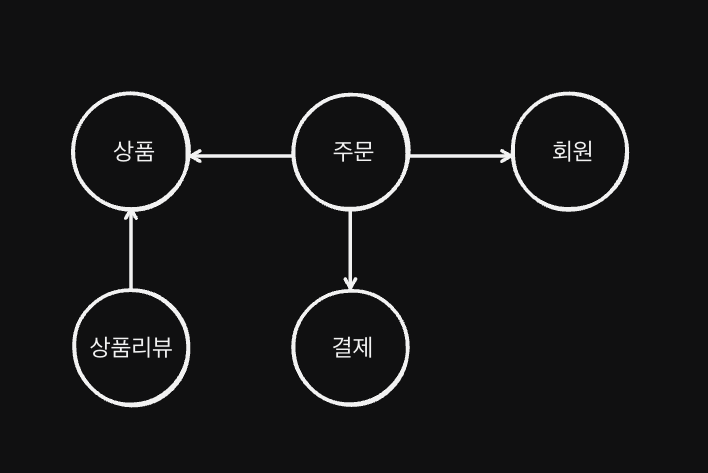
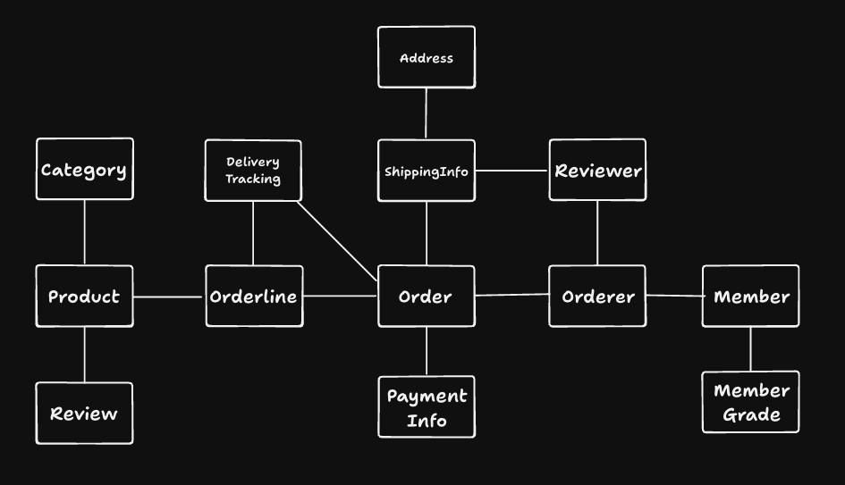
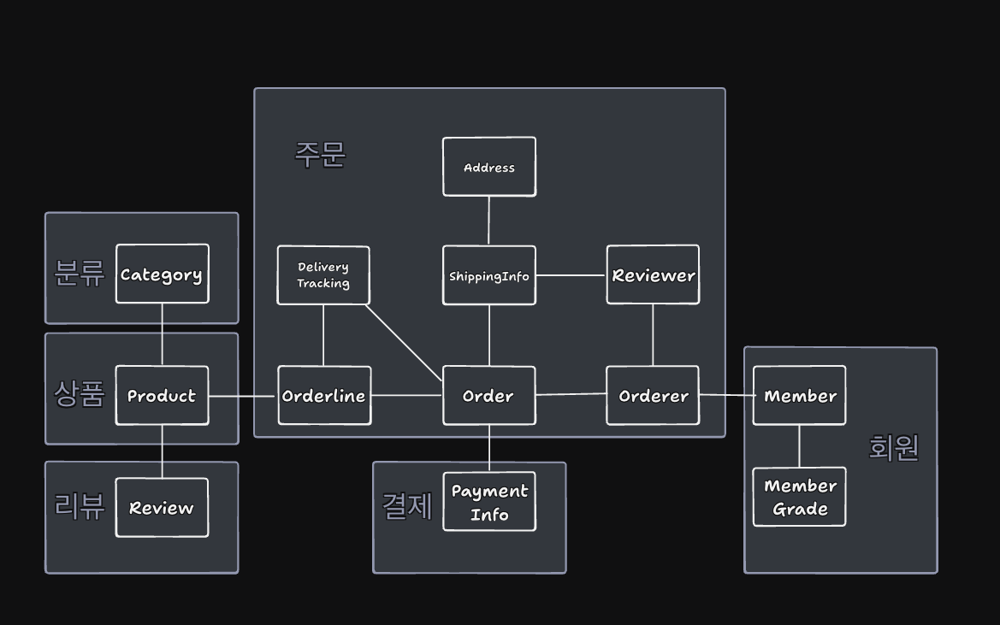
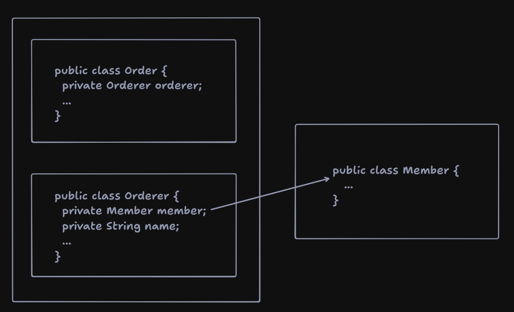

# 3장 - 애그리거트

## 애그리거트

전체 모델을 상위 수준 개념을 이용해서 표현하면 다음과 같다.



위 그림을 개별 객체 단위로 표현하면 다음과 같다.



이렇게 수십 개 이상의 테이블을 ERD 1개로 표현한다고 하면, 전체 구조를 파악하기 힘들어진다.<br>
각 도메인 간의 관계를 파악하기 힘들어지고, 이는 코드를 변경하고 확장하는 것이 어려워진다.

이렇게 복잡한 도메인을 쉽게 이해하려면, 상위 수준에서 도메인을 바라보는 방법이 필요하다.<br>
그 방법이 **애그리거트(Aggregate)** 이다.<br>
애그리거트는 관련된 객체들을 하나의 군으로 묶어준다.<br>

애그리거트를 이용해 위 그림을 다시 표현하면 다음과 같다.



애그리거트는 모델을 이해하는데 도움을 줄 뿐만 아니라, 일관성을 지키는데도 도움을 준다.<br>
애그리거트에 속한 객체들은 유사하거나 동일한 라이프사이클을 갖는다.<br>
그리고 한 애그리거트는 다른 애그리거트에 속하지 않는다.<br>

애그리거트의 경계 기준은 도메인 규칙과 요구사항이다.<br>
주문할 상품 갯수, 배송지, 주문자 정보등은 주문 시점에 결정되므로, 이들은 주문 애그리거트에 속한다.<br>
OrderLine 객체의 주문할 상품 갯수가 변경된다면, Order의 총 주문 금액도 변경될 것이다.<br>
이렇게 함께 변경되는 빈도가 높은 객체들은 하나의 애그리거트로 묶는 것이 좋다.<br>

처음 도메인 모델 설계를 할 땐 큰 애그리거트로 보이는 것들이 많을 것 이다.<br>
하지만 도메인 지식이 쌓이고 도메인 규칙을 제대로 이해할 수록 애그리거트의 실제 크기는 줄어들 것이다.<br>
필자의 경험에 따르면, 다수의 애그리거트가 한 엔티티 객체만 갖는 케이스가 많았다고 한다.<br>

## 애그리거트 루트

만약 주문 애그리거트가 다음을 포함한다면<br>
- 총 금액인 totalAmounts를 가지는 Order 엔티티<br>
- 개별 구매 상품을 나타내는 OrderLine 밸류 (quantity, price)

애그리거트에 속한 모든 객체는 정상 상태를 유지해야한다. OrderLine의 값이 변경된다면 totalAmounts도 변경되어야 한다.<br>
따라서 애그리거트 전체를 관리할 주체가 필요한데, 이 책임이 있는 것이 **애그리거트 루트 엔티티(Aggregate Root Entity)** 다.<br>

주문 애그리거트에서 루트 역할을 하는 엔티티는 Order 일 것이다.<br>
OrderLine, ShippingInfo, Orderer 등은 모두 Order에 직접, 간접적으로 속한다.<br>

### 도메인 규칙과 일관성
애그리거트에서 제공하는 기능을 애그리거트 루트 도메인에 구현한다.<br>
이 때, 애그리거트 루트에 구현하는 메소드는 도메인 규칙에 따라 일관성을 깨지지 않도록 해야한다.<br>
e.g) 배송이 시작되기 전에만 배송지 변경이 가능하다는 기능이 있다면
```java
public class Order {
  // 애그리거트 루트는 도메인 규칙을 구현한 기능을 제공한다.
  public void changeShippingInfo(ShippingInfo info) {
    verifyNotYetShipped();
    setShippingInfo(info);
  }
  
  private void verifyNotYetShipped() {
    if (state != OrderState.PAYMENT_WAITING && state != OrderState.PREPARING) {
      throw new IllegalStateException("already shipped");
    }
  }
}
```

애그리거트 외부에서 애그리거트에 속한 객체를 직접 변경하면 안된다.<br>
```java
ShippingInfo info = order.getShippingInfo();
info.setAddress("new address"); // X - 애그리거트 외부에서 내부
```
이렇게 된다면 도메인 규칙을 무시하고 일관성이 깨질 수 있다.<br>
일관성을 지키기 위해 애플리케이션 레이어에서 validation을 할 수 있지만,<br>
동일한 validation이 여러 곳에 중복될 수 있고, 유지보수가 어려워진다.<br>
```java
ShippingInfo info = order.getShippingInfo();
OrderState state = order.getState();
// application layer에서의 중복 validation의 위험성 증가
if (state != OrderState.PAYMENT_WAITING && state != OrderState.PREPARING) {
    throw new IllegalStateException("already shipped");
}
info.setAddress("new address");
```

불필요한 중복을 피하고 애그리거트 루트에서만 도메인 로직을 구현하려면<br>
아래 2가지를 지켜야 한다.
- setter 메소드의 access modifier를 public으로 하지 않는다.
- Value type은 immutable 하게 구현한다.

### 애그리거트 루트의 기능 구현

애그리거트 루트는 애그리거트 내부의 다른 객체들을 조합해 기능을 완성한다.
```java
public class Order {
  private Money totalAmounts;
  private List<OrderLine> orderLines;
  
  private void calculateTotalAmounts() {
    int sum = orderLines.stream()
      .mapToInt(orderLine -> orderLine.getPrice() * orderLine.getQuantity())
      .sum();
    this.totalAmounts = new Money(sum);
  }
}
```

애그리거트 루트는 기능 구현을 위임하는 방식으로도 구현할 수 있다.<br>
만약 OrderLine 목록을 들고있는 OrderLines 클래스가 있다면,
```java
public class Order {
    private Money totalAmounts;
    private OrderLines orderLines;
    
    public void changeOrderLines(List<OrderLine> lines) {
      orderLines.changeOrderLines(lines);
      this.totalAmounts = orderLines.getTotalAmounts();
    }
    
}

public class OrderLines {
    private List<OrderLine> orderLineList;
    
    public void changeOrderLines(List<OrderLine> lines) {
        this.orderLineList = lines;
    }

    public Money getTotalAmounts() {
        int sum = orderLineList.stream()
            .mapToInt(orderLine -> orderLine.getPrice() * orderLine.getQuantity())
            .sum();
        return new Money(sum);
    }
}
```

이렇게 구현할 수 있지만, 이렇게 된다면 OrderLines의 orderLineList를 루트 외부에서 변경할 수 있다.<br>
```java
OrderLines orderLines = order.getOrderLines();
orderLines.changeOrderLines(newLines); // X - 애그리거트 외부
```
이를 방지하려면 OrderLines를 Immutable 하게 만들거나, changeOrderLines 메소드를 package-private 으로 변경하는 등의 방법이 있다.

### 트랜잭션 범위

한 트랜잭션에서는 하나의 애그리거트만 변경하는 것이 좋다.<br>
이는 애그리거트에서 다른 에그리거트를 변경하지 않는다는 것을 의미한다.<br>

만약 부득이하게 한 트랜잭션에서 여러 애그리거트를 변경해야 한다면,<br>
애플리케이션 레이어에서 두 애그리거트를 수정하도록 해야한다. (혹은 이벤트 발행)

## 리포지터리와 애그리거트

리포지터리는 애그리거트 단위로 제공한다.<br>
즉, OrderLine 리포지터리는 존재하지 않으며, Order 리포지터리만 존재한다.<br>

애그리거트는 개념적으로 하나이므로, 리포지터리는 애그리거트 전체를 저장소에 영속화해야한다.<br>
예를 들어, Order 애그리거트와 관련된 테이블이 세 개라면 Order 애그리거트를 저장할 때<br>
애그리거트 루트에 매핑되는 테이블 뿐만 아니라 애그리거트에 속한 모든 구성요소에 매핑된 테이블에 데이터를 저장해야 한다.

동일하게 애그리거트를 구하는 리포지터리는 완전한 애그리거트를 제공해야 한다.<br>
즉 `orderRepository.findById(orderId)`는 OrderLine, Orderer 등 모든 구성요소를 포함해서 제공해야 한다.<br>

## ID를 이용한 애그리거트 참조

애그리거트도 다른 애그리거트를 참조할 수 있다.<br>
애그리거트에서 다른 애그리거트를 참조한다는 것은 다른 애그리거트 루트를 참조한다는 것과 같다.



애그리거트를 직접 참조할 때 발생할 수 있는 가장 큰 문제는 **편리함을 오용**할 수 있다는 것이다.<br>
한 애그리거트에서 다른 애그리거트에 접근 할 수 있다면, 다른 애그리거트를 쉽게 수정할 수 있다.<br>
```java
public class Order {
  private Orderer orderer;
  
  public void changeShippingInfo(
      ShippingInfo info, boolean userNewShippingAddressAsMemberAddr) {
    // ...
    if (userNewShippingAddressAsMemberAddr) {
      // 한 애그리거트 내부에서 다른 애그리거트에 접근할 수 이으면,
      // 구현이 쉬워진다는 유혹에 빠져 다른 애그리거트의 상태를 변경할 수 있게 된다.
      orderer.getMember().changeAddress(info.getAddress());
    }
  }
}
```
한 애그리거트에서 다른 애그리거트의 상태를 변경하는 것은, 애그리거트간의 의존 결합도를 높여 결과적으로 애그리거트의 변경을 어렵게 만든다.

두 번째 문제는 성능과 관련된 문제다.<br>
FetchType을 LAZY로 할지, EAGER로 할지 결정하는 것이 어려워진다.<br>

세 번째 문제는 확장성이다.<br>
초기에는 동일한 시스템내에서 애그리거트간의 참조가 가능했지만, 만약 유저 도메인이 다른 시스템으로 확장된다면<br>
이 때 부터는 애그리거트간의 직접 참조가 불가능해진다.<br>

이런 문제를 완화할 때 사용할 수 있는 것이 애그리거트를 참조할때 ID만 참조하는 것이다.<br>
이러면 애그리거트 간의 경계를 명확히 하고, 물리적으로 분리가 되어있기 때문에 모델의 복잡도를 낮춰준다.<br>
또한 애그리거트 간의 의존을 제거하므로 응집도를 높여준다.

### ID를 이용한 참조와 조회 성능

다른 애그리거트를 ID로 참조하면, 여러 애그리거트를 읽을때 조회 성능이 떨어질 수 있다.<br>
예를 들어, 주문 목록을 조회하는 페이지가 있을 때 주문 애그리거트와 회원 애그리거트를 읽어와야 한다.

```java
Member member = memberRepository.findById(ordererId);
List<Order> orders = orderRepository.findByOrdererId(ordererId);
List<OrderView> orderViews = orders.stream()
    .map(order -> {
      ProductId productId = order.getOrderLines().get(0).getProductId();
      // N+1 문제 발생
      Product product = productRepository.findById(productId);
      return new OrderView(order, member, product);
    }).collect(Collectors.toList());
```
이렇게 되면 N+1 문제가 발생할 수 있고, 이를 해결하려면 조회 전용 쿼리를 사용하면 된다.<br>
e.g.) Order, Member, Product를 조인해서 OrderView를 바로 조회하는 쿼리 (JPQL, MyBatis 등)

만약 애그리거트마다 서로 다른 DBMS를 사용한다면 위와 같은 한방쿼리로 조회할 수 없다.<br>
이럴 땐 캐시를 사용하거나 조회 전용 DB(CQRS)를 사용하는 방법이 있다.

## 애그리거트 간 집합 연관

개념적 연관관계를 똑같이 구현할 필요는 없다.<br>
카테고리와 상품이 1:N 관계라도, 다음처럼 구현하지는 않는다.
```java
public class Category {
  private Set<Product> products;
  
  public List<Product> getProducts(int page, int size) {
    // X - 애그리거트 간 집합 연관은 피해야 한다.
    return products.stream()
        .skip(page * size)
        .limit(size)
        .collect(Collectors.toList());
  }
}
```
이렇게 된다면 모든 상품을 검색해야하기 때문에, 성능에 문제가 생길 수 있다.<br>
개념적으로는 한 개의 카테고리에 여러 상품이 있는게 맞지만, 성능 문제 때문에 실제 구현에 반영하지 않는다.
```java
public class Product {
  private CategoryId categoryId;
}
```
그리고 ProductRepository를 이용해서 `findByCategoryId(page, size)` 메소드를 구현한다.<br>

N-M 관계도 마찬가지다.<br>
태그와 상품이 N-M 관계라도, 다음처럼 구현하지는 않는다.
```java
public class Tag {
  private Set<Product> products;
}

public class Product {
  private Set<Tag> tags;
}
```
대신 다음처럼 구현한다.
```java
public class Product {
    private Set<TagId> tagIds;
}
```
그리고 JPQL의 `member of`나 JOIN 뒤 SQL의 `IN` 절을 이용해서 조회한다.<br>

## 애그리거트를 팩토리로 사용하기

만약 고객이 특정 상점을 신고해서 상점이 정지상태라고 가정해보자.<br>
이 때 상품 등록 기능은 상점이 정지되었는지 확인을 하는 형태로 구현할 수 있다.
```java
public class RegisterProductService {
  
  public ProductId registerNewProduct(NewProductRequest request) {
    Store store = storeRepository.findById(request.getStoreId());
    checkNull(store);
    if (store.isBlocked()) {
      throw new IllegalStateException("store is blocked");
    }
    ProductId productId = productRepository.nextId();
    Product product = new Product(id, store.getId(), req);
    productRepository.save(product);
    return productId;
  }
}
```
이러면 도메인 로직이 애플리케이션 레이어에 노출된다.<br>
Store가 Product를 생성할 수 있는 상태인지 판단 후 Product를 생성하는 것은 논리적인 하나의 도메인 기능이기 때문이다.<br>

이 도메인 기능을 넣기 위해 별도의 도메인 서비스나 팩토리 클래스를 만들수도 있지만, Store 애그리거트의 루트에 구현할 수도 있다.
```java
public class Store {
  public Product createProduct(ProductId productId, ...) {
    if (isBlocked()) {
      throw new IllegalStateException("store is blocked");
    }
    return new Product(productId, this.id, ...);
  }
}

```
이러면 팩토리 역할을 하면서 중요한 도메인 로직을 같이 구현할 수 있다.<br>
```java
public class RegisterProductService {
  
  public ProductId registerNewProduct(NewProductRequest request) {
    Store store = storeRepository.findById(request.getStoreId());
    checkNull(store);
    ProductId productId = productRepository.nextId();
    Product product = store.createProduct(productId, req);
    productRepository.save(product);
    return productId;
  }
}
```

Product 애그리거트를 생성할때 Store 애그리거트의 상태나 데이터가 필요하다면,<br>
이렇게 애그리거트에 팩토리 메소드를 구현할 수 있다.<br>

하지만 Store 애그리거트가 Product 애그리거트를 생성할 때 많은 정보를 알아야 한다면,<br>
다른 팩토리에 위임할 수도 있다.
```java
public class Store {
  
  public Product createProduct(ProductId productId, ProductInfo pi) {
    if (isBlocked()) {
      throw new IllegalStateException("store is blocked");
    }
    return ProductFactory.create(productId, this.id, pi);
  }
}
```
이렇게 다른 팩토리에 위임하더라도 상품을 만드는 도메인 로직은 Store 애그리거트에만 존재한다.