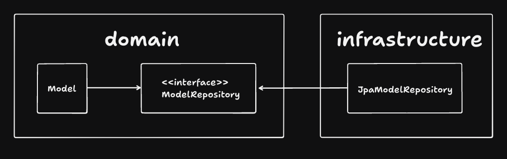
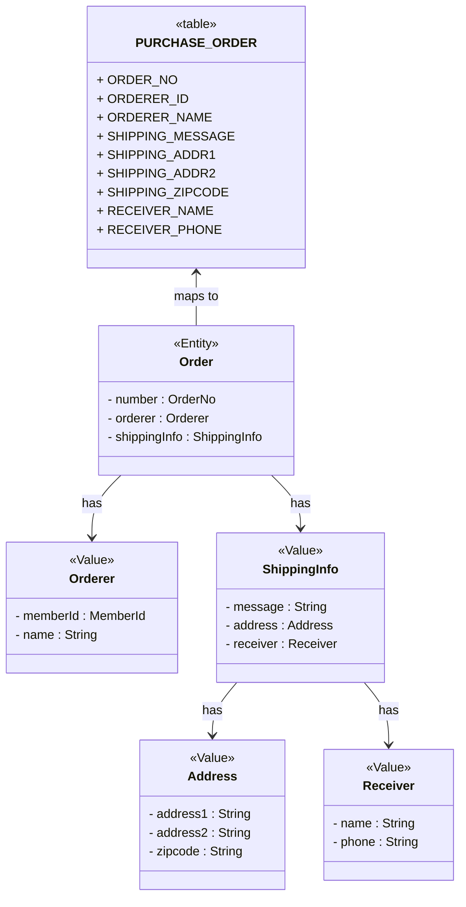

# 4장 - 리포지토리와 모델 구현

## JPA를 이용한 리포지터리 구현

객체 기반의 도메인 모델과 관계형 데이터 모델간의 매핑을 처리할 때 ORM이 주로 사용된다.<br>

### 모듈 위치
리포지터리 인터페이스는 도메인 모듈, 리포지터리 구현체는 인프라스트럭처 모듈에 위치시킨다.<br>


### 리포지터리 기본 기능 구현
인터페이스는 애그리거트 루트를 기준으로 작성한다.<br>
주문 애그리거트는 Order 루트 엔티티와 OrderLine, Orderer, ShippingInfo 등 다양한 객체를 포함하하는데<br>
이 중에서 루트 엔티티인 Order를 기준으로 인터페이스를 작성한다.

## 스프링 데이터 JPA를 이용한 리포지터리 구현

스프링 데이터 JPA 관련 설명<br>

중첩 프로퍼티로 조회가 가능<br>
Orderer 객체의 memberId 프로퍼티 기준으로 조회하는 메소드.<br>
`List<Order> findByOrdererMemberId(MemberId memberId);`

## 매핑 구현

### 엔티티와 밸류 기본 매핑 구현
애그리거트와 JPA 매핑을 위한 기본 규칙.<br>
- 애그리거트 루트는 엔티티이므로 `@Entity`로 매핑 설정

한 테이블에 엔티티와 밸류 데이터가 같이 있다면,<br>
- 밸류는 `@Embeddable`로 매핑 설정
- 밸류 타입 프로퍼티는 `@Embedded`로 매핑 설정

e.g.) 주문 애그리거트의 루트 엔티티는 Order고, Orderer, ShippingInfo는 밸류다.<br>
그리고 ShippingInfo에 속한 Address와 Receiver 또한 밸류다.


이렇게 루트 엔티티와 그 안에 속한 밸류들을 한 테이블로 매핑할 때가 많다.

```java
import java.io.Serializable;

@Embeddable
public class Orderer {

  @Embedded
  @AttributeOverride(
      name = "id",
      column = @Column(name = "orderer_id")
  )
  private MemberId memberId;

  @Column(name = "orderer_name")
  private String name;
}

@Embeddable
public class MemberId implements Serializable {
  @Column(name = "member_id")
  private String id;
}
```

Orderer에서 memberId는 Member 애그리거트의 ID를 참조하는 밸류다.<br>
MemberId 밸류는 컬럼명이 "member_id" 이므로, 이걸 override해서 "orderer_id"로 매핑한다.<br>

```java
@Embeddable
public class ShippingInfo {
  @Embedded
  @AttributeOverrides(
      @AttributeOverride(
          name = "zipCode",
          column = @Column(name = "shipping_zipcode")
      ),
      @AttributeOverride(
          name = "address1",
          column = @Column(name = "shipping_addr1")
      ),
      @AttributeOverride(
          name = "address2",
          column = @Column(name = "shipping_addr2")
      )
  )
  private Address address;
  
  @Column(name = "shipping_message")
  private String message;
  
  @Embedded
  private Receiver receiver;
}
```

그리고 루트 엔티티 Order는 다음처럼 밸류 객체들을 선언한다.
```java
@Entity
public class Order {
    @Embedded
    private Orderer orderer;
    
    @Embedded
    private ShippingInfo shippingInfo;
}
```

### 기본 생성자
Receiver 같은 밸류 타입은 값을 생성자 파라미터에서 전달받으면 된다.<br>
따라서 기본 생성자가 필요없지만, JPA에서 `@Entity`와 `@Embeddable` 객체를 생성할 때 기본 생성자가 필요하므로<br>
protected 접근 제어자로 기본 생성자를 선언해준다.

### 필드 접근 방식 사용

Hibernate는 `@Id`나 `@EmbeddableId` 선언이 필드인지, 메소드인지 확인 후 접근 방식을 결정한다.<br>
필드라면 필드 접근 방식 (`@Access(AccessType.FIELD)`), 메소드라면 프로퍼티 접근 방식 (`@Access(AccessType.PROPERTY)`)을 사용한다.<br>
프로퍼티 방식이라면 getter/setter가 필요한데, 이는 캡슐화를 해치므로 필드 접근 방식을 사용한다.

### AttributeConverter를 이용한 밸류 매핑 처리

밸류 타입의 프로퍼티를 한 컬럼에 매핑할 경우도 있다.
e.g.)
```java
public class Length {
  private int value;
  private String unit;
}
```
위 객체를 `WIDTH VARCHAR(100)` 컬럼에 매핑해야하는 케이스가 있다면, AttributeConverter를 사용한다.

```java
@Converter(autoApply = true)    // true라면 프로퍼티 위에 @Convert 선언할 필요없이 자동으로 Money 타입을 변환해준다.
public class MoneyConverter implements AttributeConverter<Money, Integer> {
  
  @Override
    public Integer convertToDatabaseColumn(Money attribute) {
        return attribute != null ? attribute.getAmount() : null;
    }

    @Override
    public Money convertToEntityAttribute(Integer value) {
        return value != null ? new Money(value) : null;
    }
}  
}

@Entity
public class Order {
  
  @Column(name = "total_amounts")
  @Convert(converter = MoneyConverter.class)
  private Money totalAmounts;
}
```

### 밸류 컬렉션: 별도 테이블 매핑


## 애그리거트 로딩 전략

JPA 매핑할 때 항상 기억해야할 점은 **애그리거트에 속한 객체가 모두 모여야 완전하다는 것**이다.<br>
다음과 같이 사용할 때 애그리거트 루트에 속한 모든 객체가 완전해야한다.<br>
```java
Product product = productRepository.findById(productId);
```

이럴 때 `FetchType.EAGER`로 설정하면 애그리거트 루트를 조회할 때 연관된 모든 객체를 함께 조회한다.<br>
하지만 연관된 객체가 많아지면 이는 조회 성능에 약영향을 준다.<br>
예를 들어, Order 애그리거트에 Image와 Option이 연관되어 있다면 Order는 `N(Image) * M(Option)` 번 조회된다.<br>
하이버네이트가 중복된 Order를 제거해주지만 불필요한 조회가 많이 발생한다.<br>

애그리거트가 완전해야 하는 이유는 다음 이유다.
- 상태를 변경할 때 애그리거트 상태가 완전해야 한다.
- 응답을 반환할 Presentation 레이어에서 애그리거트 상태가 완전해야 한다.

이 중 두번째는 조회 전용 기능과 모델을 사용하는게 더 낫기 때문에, 애그리거트의 완전한 로딩은 상태 변경과 더 관련이 있다.<br>
따라서 `FetchType.LAZY`로 설정 후, 상태 변경이 필요할 때만 연관된 객체를 로딩하는게 낫다.<br>
물론 지연 로딩은 즉시 로딩보다 쿼리 실행 횟수가 많아질 수 있으므로 상황에 맞게 선택해야 한다.

## 애그리거트의 영속성 전파

애그리거트가 완전한 상태여야 한다는 것은 조회 뿐만 아니라 저장 및 삭제도 해당된다.<br>
- save()는 애그리거트 루트와 그에 속한 모든 객체를 저장해야 한다.
- delete()는 애그리거트 루트와 그에 속한 모든 객체를 삭제해야 한다.

@Embeddable 매핑 타입은 함께 저장되고 삭제되므로 따로 cascade (영속성 전파) 속성을 지정하지 않아도 된다.<br>
하지만 @OneToOne, @OneToMany는 cascade 기본값이 없으므로 속성에 `PERSIST, REMOVE`를 지정해줘야 한다.<br>