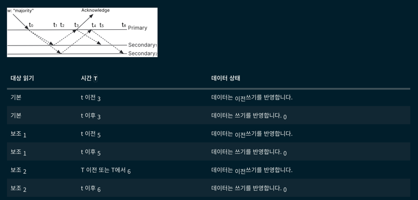

# readConcern (읽기 고려)

readConcern 옵션을 설정하여 읽기 작업의 일관성 및 격리 수준을 제어할 수 있음. 
Standalone, 레플리카 셋, 샤드 클러스터 모두에서 readConcern 옵션을 사용할 수 있음. 

## local

요청받은 노드에서 가장 최근 데이터를 반환함. 
따라서 읽은 데이터는 롤백될 수 있음. 
왜냐하면 Transaction이 majority인 경우에는 과반수 이상의 노드에 커밋되지 않으면 롤백이 될 수 있기 때문임. 
기본값이며 available 보다는 높은 일관성을 제공함. (장애 상황에서는 읽기가 안 될 수 있음) 

## available

요청받은 노드에서 가장 최근 데이터를 반환함. 
따라서 읽은 데이터는 롤백될 수 있음. 
local과 차이는 해당 노드가 정상인지 아닌지(고립 포함) 체크하지 않고 데이터를 반환함. 
예를 들어, 해당 노드가 레플리카에서 정상적이지 않은 상태여도 데이터를 반환함. 
하지만 정상적이지 않은 상태를 유지하면 해당 노드는 레플리카에서 제거될 것임. 

## majority

레플리카에서 과반수 이상의 노드에 적용된 데이터를 반환함. 
따라서 읽은 데이터는 롤백되지 않음. (과반수에 적용되어 majority commit이 되었고, 그 결과 스냅샷에 해당 데이터가 적용되었기 때문) 
그리고 과반수 이상의 노드에 적용되기 이전에, 특정 노드에서는 예전 데이터를 반환할 수 있음. 

## linearizable

primary 노드에서만 수행되며, 쓰기 작업이 성공된 데이터를 반환함. 
따라서 만약 majority commit이 수행중이라면, 해당 결과를 기다리고 데이터를 반환함. 
그리고 multi-document 트랜잭션 내에서 linearizable readConcern을 사용할 수 없음. 

## snapshot
multi-document 트랜잭션 내에서 사용할 수 있음. 
트랜잭션이 시작된 시점의 스냅샷 기반으로 데이터를 읽음. 
따라서 트랜잭션이 적용되는 동안 일관된 데이터를 읽을 수 있음. 

##
linearizable → 락 / 리더 선출 (강한 일관성으로 분산 락에 유리) 
majority → 기본 비즈니스 데이터 (캐시) 
local → 피드처럼 일관된 데이터보다 성능이 더 높은 효율성을 제공할 때 
snapshot -> 특정 시점의 일관된 데이터 조회